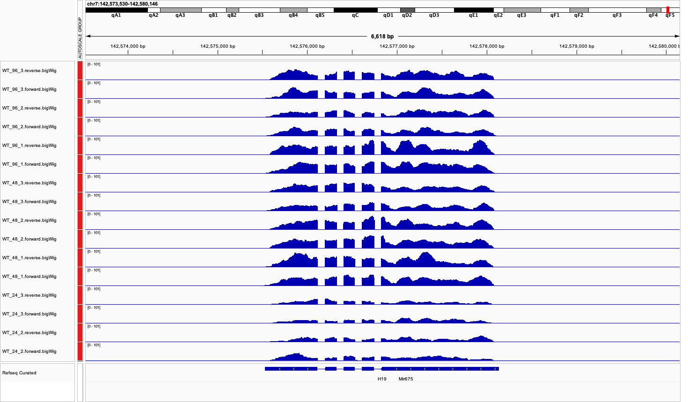
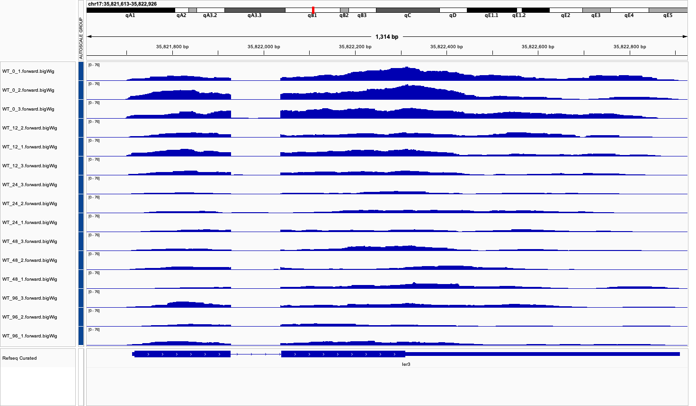
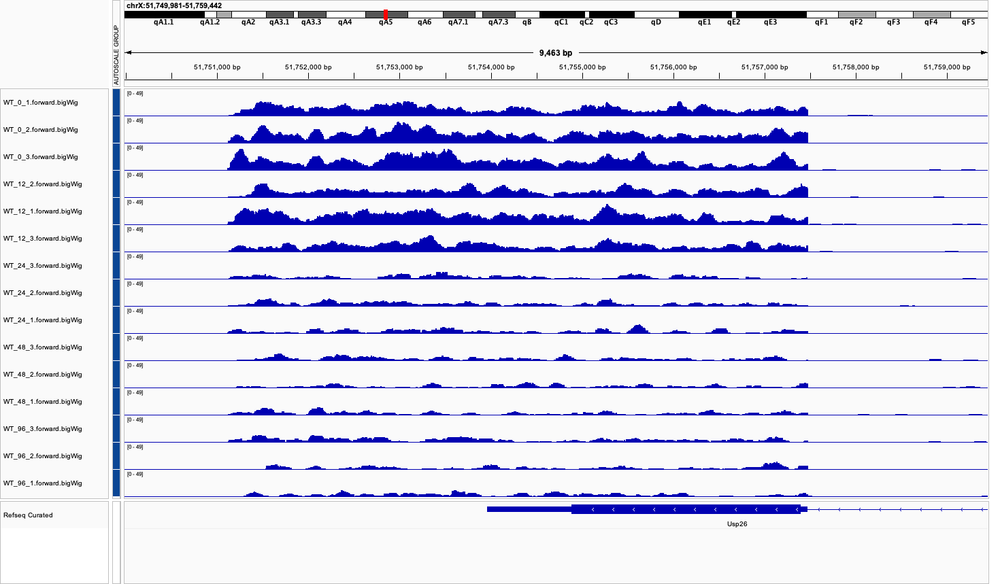

# PowerPuffGenes
RNA-seq Time Course Analysis of Doxycycline-Induced Gene Expression

## Introduction

Understanding the temporal dynamics of gene expression is crucial for deciphering complex biological processes such as stem cell differentiation and responses to stimuli. This project uses a doxycycline (dox)-inducible system in mouse stem cells to explore gene expression changes over time. In this system, dox activates gene expression via the rtTA-TRE mechanism. However, dox itself may also exert off-target effects on the transcriptome.

To investigate these effects, we analyzed an RNA-seq dataset from Dr. Rinn’s lab, which spans five time points (0, 12, 24, 48, and 96 hours) with three replicates each. Data were processed using the `nf-core/rnaseq` pipeline, and differential expression was assessed with **DESeq2**.

## Project Goals

1. Identify genes significantly regulated following doxycycline administration.
2. Characterize temporal gene expression profiles, distinguishing between transient and prolonged responses.
3. Investigate the biological roles and chromosomal locations of significantly regulated genes.

## Key Findings

- Out of 55,401 genes, 794 were significantly differentially expressed.
- Of those, 27 genes displayed **prolonged expression changes**—either up- or down-regulation beginning at early time points (12 or 24 hours) and persisting through the final time point (96 hours).
- These prolonged expression patterns may indicate lasting transcriptional or epigenetic changes in response to dox.

### Gene Ontology and Functional Insights

Gene ontology analysis revealed potential regulatory roles for three prolonged DEGs: **H19**, **Ier3**, and **Usp26**.

---

### 🧬 H19

- **Type**: Long non-coding RNA (lncRNA)  
- **Role**: Embryonic growth regulator; involved in an imprinted gene network  
- **Expression**: Prolonged **up-regulation** after dox treatment  

  
**Figure:** IGV track showing increasing H19 expression from 24 to 96 hours.

---

### 🧬 Ier3

- **Role**: Involved in the ERK signaling pathway affecting proliferation, differentiation, and survival  
- **Expression**: Prolonged **down-regulation**  

  
**Figure:** Ier3 expression declines steadily from 0 to 96 hours.

---

### 🧬 Usp26

- **Role**: Deubiquitinase; potential regulator of transcription factors like PRC1  
- **Expression**: Prolonged **down-regulation**  

  
**Figure:** Usp26 expression drops after 12 hours and remains low through 96 hours.

---

## How to Run the Code

### Prerequisites
This project was developed with R 3.4.1, and it requires several CRAN and Bioconductor packages. Make sure to install the necessary packages before running the analysis.
```r
# CRAN packages
install.packages(c(
  "dplyr", "tidyr", "tibble", "readr", "ggplot2", "purrr", "magrittr",
  "pheatmap", "textshape", "Rcpp", "matrixStats", "broom", "reshape",
  "ggrepel", "ggdendro", "circlize", "stringr", 
))

# Tidyverse meta-package (optional if not already installed)
install.packages("tidyverse")

# Install Bioconductor package manager if needed
if (!require("BiocManager", quietly = TRUE))
    install.packages("BiocManager")

# Bioconductor packages
BiocManager::install("IRanges")
BiocManager::install("rtracklayer")
BiocManager::install("DESeq2")
```

### Run Instructions
1. Clone the repository
   ```bash
   git clone https://github.com/your-username/PowerPuffGenes.git
   cd PowerPuffGenes
   ```
2. Open final_script.Rmd in RStudio.
3. Click the Knit button at the top of the RStudio interface to execute the full analysis and render the output as an HTML report.
   Alternatively, you can knit the document from the R console:
   ```r
   rmarkdown::render("final_script.Rmd")
   ```
Make sure any input files referenced in the Rmd file are in the correct paths (e.g., results/, data/).

## Tools & Pipeline

- Data processing: [`nf-core/rnaseq`](https://nf-co.re/rnaseq)  
- Differential expression: `DESeq2`  
- Visualization: `ggplot2`, `IGV`

## License

This project is released under the MIT License. See the [LICENSE](LICENSE) file for details.

---

## Acknowledgments

Special thanks to Dr. Rinn’s lab for providing the dataset and to the [Computational Genomic Lab](https://www.lncrna.io/teaching) for guidance on RNA-seq analysis and interpretation.
