# PowerPuffGenes
RNAseq and ATACseq Time Course Analysis of Doxycycline-Induced Gene Expression

## Introduction
Understanding the temporal dynamics of gene expression is crucial for deciphering complex biological processes such as stem cell differentiation and responses to stimuli. This project uses a doxycycline (dox)-inducible system in mouse stem cells to explore gene expression changes over time. In this system, dox activates gene expression via the rtTA-TRE mechanism. However, dox itself may also exert off-target effects on the transcriptome. Levering from Dr. Rinn's lab RNA-seq data from experiments on mouse and human stem cells with addition of dox at different time points (0, 12, 24, 48, 96 hours), we explore the effects of dox on gene expression.

The raw sequencing reads were processed using the [nf-core/rnaseq pipeline](https://nf-co.re/rnaseq) version 3.18, a standardized and reproducible bioinformatics pipeline built using [Nextflow](https://www.nextflow.io/).

- Image from nf-core

In brief, the pipeline performs the following key steps:

1) **Quality Control:** Raw reads were assessed using FastQC and summarised using MultiQC.
2) **Read Alignment:** Reads were aligned to the mouse reference genome (e.g., GRCm39/mm39, specify version) using the STAR aligner. STAR (Spliced Transcripts Alignment to a Reference) is efficient at mapping RNA-seq reads across splice junctions. 
3) **Quantification:** Gene expression levels were quantified using Salmon (or RSEM, specify which was used by the pipeline run). Salmon is a fast tool for transcript quantification using quasi-mapping and a lightweight alignment approach, which then summarizes transcript counts to the gene level. 

The pipeline I/O is the following: 

- **Input:** Raw FASTQ files (paired-end reads recommended) and a sample sheet defining the experimental design (samples, conditions, replicates).
- **Output:** The pipeline generates numerous output files. Key files used in this analysis include:
    * `salmon.merged.gene_counts.tsv`: Raw gene-level counts estimated by Salmon. Used as input for DESeq2 statistical modeling.
    * `salmon.merged.gene_tpm.tsv`: Gene-level Transcripts Per Million (TPM) values. Used for expression level interpretation and visualization, as TPM is normalized for gene length and sequencing depth.
    * `multiqc/multiqc_report.html`: An aggregated quality control report across all samples.
    * Alignment files (BAM format): Detailed mapping results (not directly used in this DE analysis but available).

## Objectives
1) Identify genes significantly regulated following dox administration.
2) Characterize the temporal profiles of these regulated genes, distinguishing between transient and sustained responses.
3) Investigate the role, significance, and chromosomal location of these genes.

## Section 1: Differential Expression Analysis

### Section 1.1: DESeq and TPM analysis (RNA-seq data processing)

#### Quality control analysis using principal component analysis (PCA)

To explore the overall structure of our mouse RNA-seq dataset and assess how doxycycline influences the transcriptome over time, we performed principal component analysis (PCA). By reducing the high-dimensional gene space into orthogonal components, PCA enables visualization of the dominant sources of variance across samples—here, five timepoints (0, 12, 24, 48, 96 hr) with three biological replicates each. In this analysis, we centered and scaled the log-transformed TPM values for all genes, then projected each sample onto the first two principal components, which together capture 58% of the total variance. The resulting PCA plot (Figure PCA_mouse) provides a rapid check of sample quality, replicate concordance, and the temporal progression of doxycycline’s impact on gene expression in mouse stem cells.

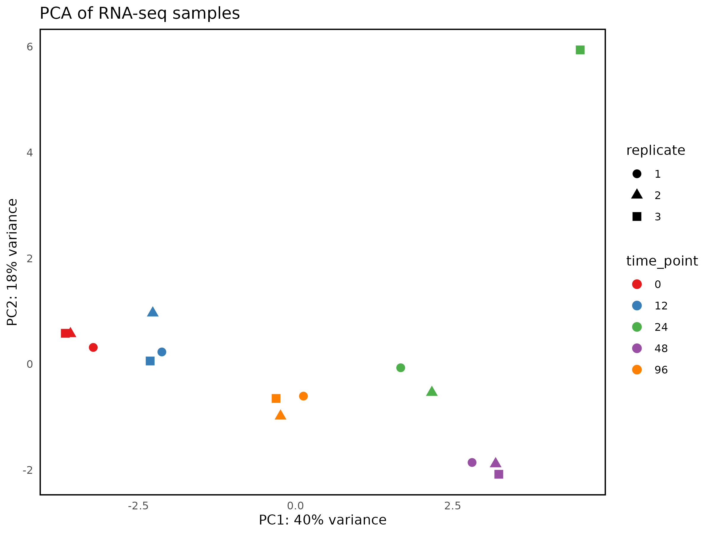
**Mouse Results:** The first principal component (PC1, 40% variance) cleanly separates early (0–12 hr) from later timepoints (24–96 hr), indicating a strong time-dependent transcriptional shift following doxycycline exposure. Control (0 hr) and 12 hr replicates cluster tightly on the negative side of PC1, suggesting minimal off-target effects at the earliest timepoint. As exposure lengthens, samples migrate positively along PC1, with 24 hr near the origin and 48 and 96 hr diverging further, reflecting the cumulative transcriptional response. The second component (PC2, 18% variance) captures subtler variation, largely distinguishing individual replicates—most notably one of the 96 hr samples that shifts upward—highlighting minor batch or replicate effects. Surprisingly, the analysis revealed an anomaly in timepoint 24 where it point doesn't cluster with the other two replicates. It will be key to advance with precaution of this outlier result. Overall, the PCA confirms robust replicate cohesion and reveals a progressive, time-driven restructuring of the mouse transcriptome under doxycycline treatment.

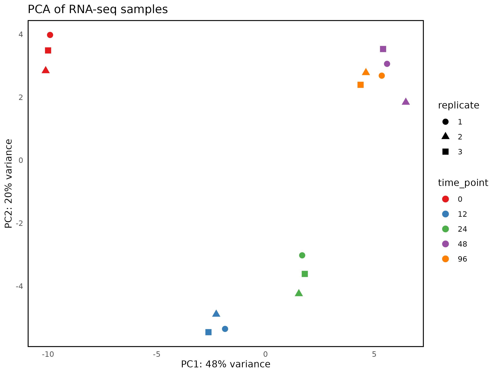
**Human Results:** In the human samples, PC1 (48% of variance) again drives a clear temporal trajectory from untreated to long‐term doxycycline exposure. The 0 hr replicates cluster at extreme negative PC1 with high PC2 values, underscoring a distinct baseline expression state. At 12 hr, samples shift leftward and downward (negative PC1, lowest PC2), indicating an early, transient off‐target response to doxycycline. By 24 hr, replicates rebound toward the PC1 origin and mid‐range PC2, suggesting that the initial perturbation begins to stabilize. The most dramatic shift occurs by 48 hr and 96 hr, where all replicates move to large positive PC1—reflecting a robust, sustained transcriptional reprogramming—and to intermediate PC2 values. Notably, the 48 hr replicates occupy slightly higher PC2 than the 96 hr ones, hinting at subtle adaptive changes between these later timepoints. Tight clustering of each shape at its timepoint confirms strong replicate consistency, and together these patterns reveal a progressive, time‐dependent remodeling of the human stem cell transcriptome under doxycycline induction.

#### Gene expression changes depicted by volcano plots
We next examined differential expression at each post-dox timepoint using volcano plots. For each comparison (12 hr, 24 hr, 48 hr, and 96 hr vs. 0 hr), we plotted the log₂ fold-change (x-axis) against –log₁₀ of the Benjamini–Hochberg adjusted p-value (y-axis). Vertical dashed lines at ±1 log₂FC and a horizontal dashed line at –log₁₀(p-adj) = 1.3 (p-adj = 0.05) mark our thresholds for biologically meaningful and statistically significant changes. Genes meeting both criteria are highlighted in red (upregulated) or blue (downregulated), while non-significant genes remain gray. These volcano plots provide an intuitive snapshot of how many genes respond, in which direction, and with what confidence at each interval following doxycycline exposure.

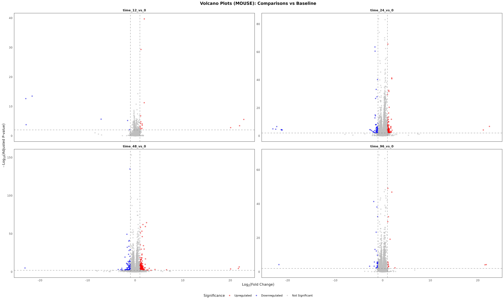
**Mouse Results**: At 12 hr post-dox (top left), only a small cohort of genes cross both significance thresholds, with modest fold-changes clustered just beyond ±1 log₂FC. This early, limited response likely reflects immediate off-target or stress-related effects of doxycycline. By 24 hr (top right), the number of significant hits grows substantially: dozens of genes become upregulated or downregulated, though most fold-changes remain within ±5-fold. The response peaks at 48 hr (bottom left), where hundreds of genes achieve highly significant p-values (–log₁₀(p-adj) > 100 for the strongest hits) and larger fold-changes extend well beyond ±5 log₂FC. This dramatic expansion indicates a robust transcriptional reprogramming as the system fully engages under doxycycline. At 96 hr (bottom right), the total count of differentially expressed genes remains high, but both the number of extreme fold-changes and the height of significance tails off slightly compared to 48 hr, suggesting that after two days of induction the transcriptome begins to reach a new steady state. Overall, the volcano plots trace a gradual escalation from a muted early perturbation to a maximal, widespread gene‐expression shift by 48 hr, followed by partial stabilization at 96 hr.

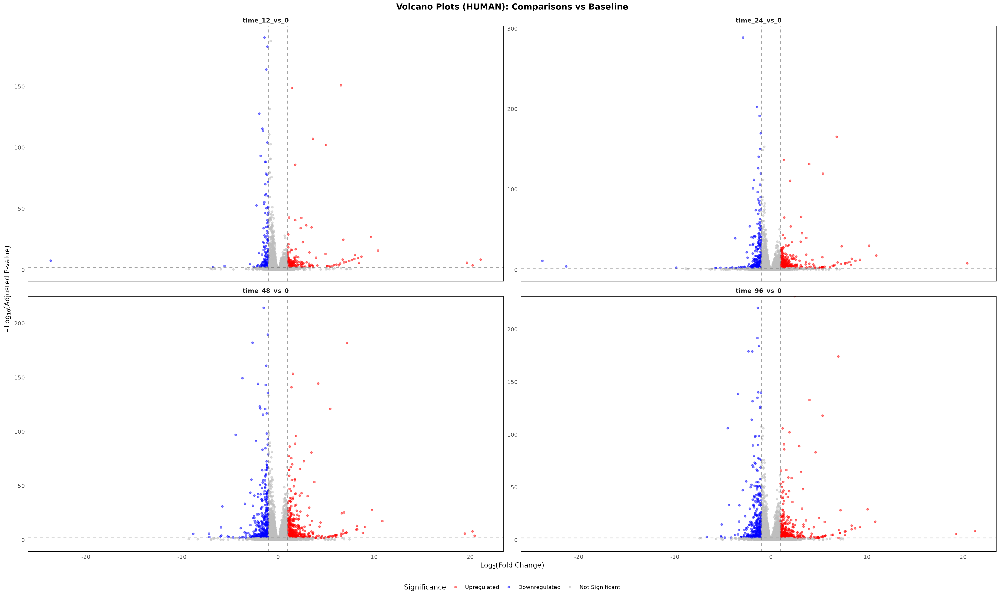
**Human Results:** In the human samples, doxycycline induces a rapid and sweeping transcriptional reprogramming that intensifies over time. At 12 hr (top left), the volcano plot is skewed toward repression: hundreds of genes fall below –1 log₂FC with –log₁₀(p-adj) values well above the 1.3 significance threshold, while fewer genes are significantly upregulated. By 24 hr (top right), both up- and downregulated cohorts expand markedly—more genes cross the ±1 log₂FC lines and reach higher –log₁₀(p-adj) values—signaling an amplified response as target induction and off-target effects converge. The 48 hr comparison (bottom left) represents the peak of differential expression: thousands of genes on both sides exceed our cutoffs, fold-changes stretch beyond ±20 log₂FC, and –log₁₀(p-adj) tops 200, reflecting full engagement of doxycycline‐driven programs. By 96 hr (bottom right), although the total count of significant genes remains high, both the extreme fold-changes and the very highest significance levels recede slightly from the 48 hr maximum, suggesting that the human transcriptome is beginning to stabilize into its new, induced state.

#### Overall patterns and locus of gene expression changes ilustrated by circos plot 

To gain a genome-wide perspective on where doxycycline-responsive genes reside, we plotted differential expression loci on a circos diagram mapped to the mm10 mouse and hg38 human reference. Each concentric ring corresponds to one comparison against the 0 hr baseline—outermost for 12 hr, then 24 hr, 48 hr, and innermost for 96 hr—showing per-gene log₂ fold-changes as radial deviations from the dashed zero line. Red dots mark upregulated genes, blue dots mark downregulated genes, and their angular positions correspond to chromosomal coordinates on the ideogram. This multi-track layout allows us to visualize both the temporal evolution of fold-change magnitude and the chromosomal distribution of responsive genes, revealing whether expression changes cluster in particular genomic regions or disperse broadly across the karyotype.

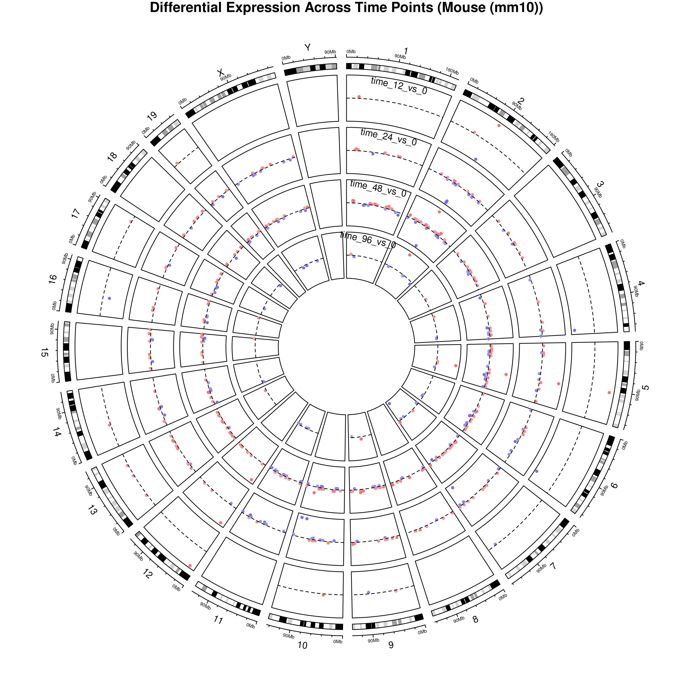
**Mouse Results:** At 12 hr, only a sparse scattering of red and blue points appears in the outermost ring, indicating a few loci—on chromosomes such as 2, 7, and 11—respond early, but with modest magnitude. By 24 hr, the second ring fills out with more dysregulated genes evenly distributed across nearly all autosomes, hinting at a genome-wide engagement of transcriptional programs. The 48 hr track exhibits the greatest density and radial extent of points: both up- and downregulated genes sprawl across every chromosome, with particularly pronounced clusters on chromosomes 3, 5, and X, signifying peak fold-changes and statistical confidence at this timepoint. Finally, the innermost 96 hr ring shows that while differential expression remains widespread, the overall density and radial distances of dots diminish slightly compared to 48 hr—suggesting that, after two days of induction, the transcriptome begins to settle into its new steady state. Throughout, the lack of tight hotspots and the broad chromosomal coverage emphasize that doxycycline’s off-target and induced effects orchestrate a coordinated, genome-wide transcriptional response rather than a locus-specific phenomenon.

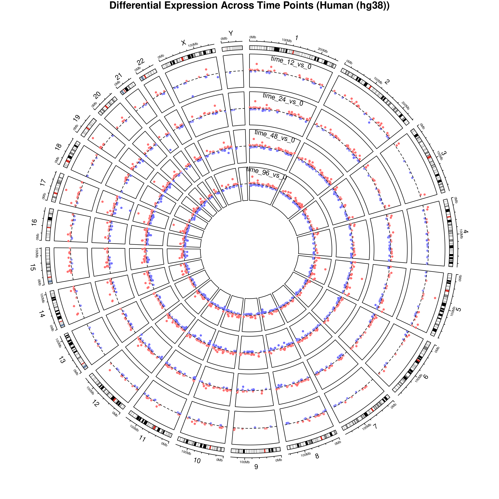
**Human Results:** In the human circos plot, the temporal escalation of differential expression mirrors—and even exceeds—the breadth seen in mouse. In the outermost 12 hr ring, only a smattering of red and blue points appears across autosomes 1–22 and X, indicating an early but modest off-target effect. By 24 hr (second ring), the density of dysregulated loci grows substantially: upregulated (red) and downregulated (blue) genes span nearly every chromosome, with slight enrichments on chromosomes 2, 7, and 12. At 48 hr (third ring), the plot reaches its apex—dots crowd each sector, often extending farther from the zero-line than at earlier timepoints, and both up- and down-regulated genes distribute almost uniformly around the circle. Finally, at 96 hr (innermost ring), while differential expression remains pervasive, the overall radial distances of the points contract only marginally compared to 48 hr, suggesting that human cells maintain a sustained, genome-wide transcriptional reprogramming after four days of doxycycline induction. The absence of narrow hotspots and the consistent chromosomal coverage reinforce that, as in mouse, doxycycline’s effects in human stem cells unfold as a coordinated, global remodeling of gene expression rather than a locus-specific response.

#### Summary and next steps
Here we have established that doxycycline induces a clear, time‐dependent transcriptional program in both mouse and human stem cells: PCA revealed a progressive shift from baseline through 96 hr with tight replicate cohesion (aside from one outlier at 24 hr in mouse), volcano plots quantified the escalating number and magnitude of differentially expressed genes—peaking at 48 hr before partially stabilizing at 96 hr—and circos diagrams showed that these changes occur broadly and evenly across all chromosomes rather than at isolated hotspots. Having characterized when, how strongly, and where in the genome genes respond to doxycycline, we now turn in Section 1.2 to a gene‐centric analysis: classifying transcripts by the earliest timepoint at which they become significantly deregulated and assessing which of these changes persist through the full 96 hr course. This will allow us to distinguish transient “early responders” from sustained, long‐term shifts and prioritize candidates for downstream functional follow-up.

### Section 1.2: Prolonged Gene Selection
Gene expression changes in response to stimuli can be broadly categorized as transient or prolonged. Transient changes are short-lived and may reflect immediate cellular responses such as signaling events or stress adaptation. In contrast, prolonged changes suggest stable regulatory shifts that may contribute to long-term cellular adaptations. Understanding these patterns can provide insight into gene regulatory mechanisms and cellular dynamics. 

This analysis focuses on identifying genes that exhibit sustained differential expression over a time-course following dox induction, classifying them by when their change begins and persisting through 96 hours.

#### Methods

1) Classifying Genes by Timing of Expression Change
- A custom function categorize_gene_expression() is used to examine the results of differential expression over time.
- Each gene is assigned to one of three groups based on the earliest timepoint at which it begins to show a statistically significant change in expression that persists through to 96 hours: 12h-to-96h sustained change, 24h-to-96h sustained change and 48h-to-96h sustained change.

This allows the separation of genes by the onset timing of their response to dox induction.

2) Computing Expression Statistics
The function calculate_stats() is applied to TPM values of genes in the classified groups.
For each gene, the function compares expression between 0 hours (baseline) and 96 hours (final timepoint):
- Calculates log2 fold change between the two timepoints,
- Computes a p-value using a statistical test (e.g., t-test across biological replicates),
returns a statistical summary for each gene.

3) Filtering for Significant Genes
- The p-values from the statistical comparison are adjusted for multiple hypothesis testing using the Benjamini-Hochberg procedure.
- Genes with an adjusted p-value below a user-defined threshold (P_VALUE_FILTER) are selected as significantly differentially expressed.

Only genes that both: (1) Fall below this significance threshold, and (2) Show a sustained expression change up to 96h are retained for further analysis and output.

#### Mouse Results
- In a dox-inducible RNA-seq experiment in mouse stem cells, 464 genes exhibited transient expression changes, while only 10 genes showed sustained differential expression throughout the time course.
- Of the sustained genes, 3 genes were upregulated following dox induction, with their TPM values steadily increasing across time points (mean TPM rising from 10.5 at 0 hours to 23.4 at 96 hours).
- Conversely, 7 sustained genes were downregulated, with their mean TPM decreasing from 3.0 at 0 hours to 1.0 at 96 hours.

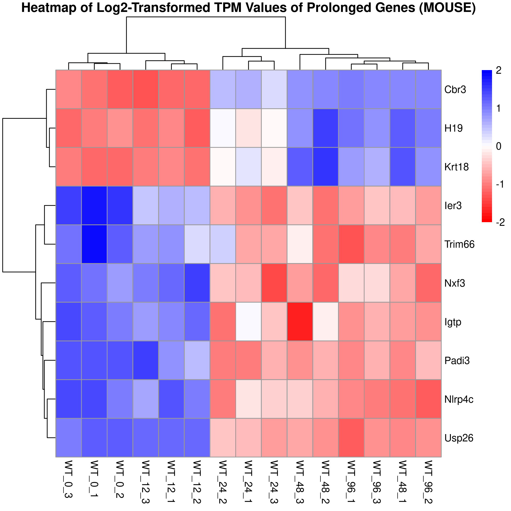
- Principal grouping of samples indicated that time points 0 and 12 hours were similar in gene expression profiles, whereas samples from 24, 48, and 96 hours formed a distinct cluster, suggesting that major transcriptional changes began after 24 hours of dox treatment. Heatmap analysis confirmed that the divergence in gene expression became prominent starting at 24 hours.

##### Summary
These findings highlight a sharp transition in gene expression dynamics after 24 hours of dox induction, with only a small subset of genes maintaining prolonged up- or downregulation.

#### Human Results
- 1,494 genes exhibited transient expression changes, while 134 genes showed sustained differential expression throughout the time course.
- Among the sustained genes, 54 were upregulated after dox treatment, with mean TPM values steadily increasing from 3.2 at baseline to 15.3 at 96 hours.
- 80 sustained genes were downregulated, with their mean TPM values decreasing from 20.6 at 0 hours to 5.9 at 96 hours.

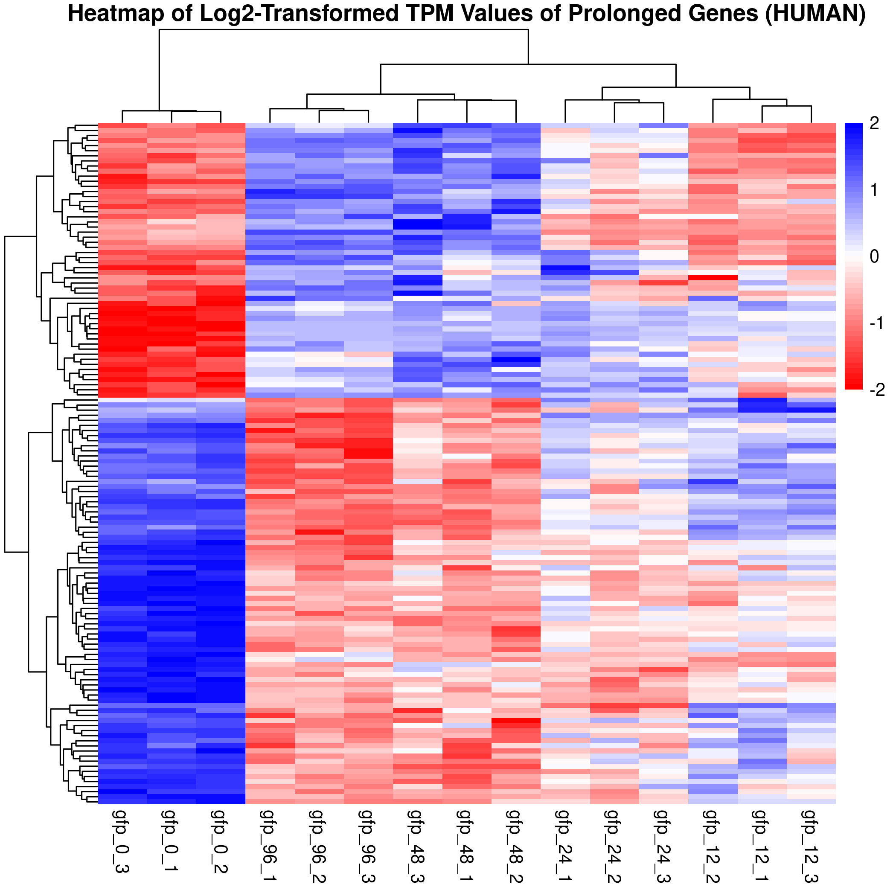
- The 0-hour time point in human cells already displayed a distinct expression profile compared to all subsequent time points.
- Samples from 12 and 24 hours clustered together, suggesting an early shift in gene expression after dox treatment, followed by a further divergence where 48- and 96-hour samples formed a distinct group with an opposite expression pattern relative to 0 hours.

##### Summary
These findings indicate a rapid and more extensive transcriptional response to dox induction in human stem cells compared to mouse stem cells, with clearer early-stage changes and a larger set of genes showing prolonged regulation.

### Section 2: ATAC-seq analysis
To determine if chromatin accessibility of prolonged gene changes due to dox exposure in mouse and human stem cells. We have performed a time course series of experiments measuring chromatin accessibility (ATAC-seq peaks) upon exposure to dox. These are 0, 30, 60, 90, 120, 150 minutes.
Each time point has a replicate. The fastq sequencing files were processed by the
NF_CORE ATAC-seq pipeline v-2.12 (https://nf-co.re/atacseq/2.1.2/).

#### Methods
1) Data Collection
- ATAC-seq performed at 0, 30, 60, 90, 120, and 150 minutes after dox exposure, with replicates.
Data Processing
- Raw fastq files processed using NF-CORE ATACseq pipeline v2.1.2.

2) Peak Import and Consensus Identification
- Import .broadPeak files with a custom import_peaks() function.
- Identify consensus peaks across replicates for each time point.

3) Condition-Specific Peaks
- Define non-dox (0 min) and dox (30–150 min) groups.
- Find peaks unique to each condition by comparing overlaps.

4) Genome Annotation
- Load genome annotations (GTF) and define gene promoters (±2 kb from transcription start sites).

5) Functional Overlap Analysis
- Identify overlaps between dox-specific peaks and gene promoters.

6) Integration with RNA-seq
- Cross-reference prolonged genes (from RNA-seq) with ATAC-seq promoter overlaps
- Find upregulated genes with promoter accessibility.
- Identify downregulated genes lacking associated ATAC peaks.

#### Mouse Results
- This is how many peaks are common in dox: 38880
- This is how many peaks are unique to dox condition: 1774
- This is how many dox common peaks overlapped gene promoters: 18753
- 
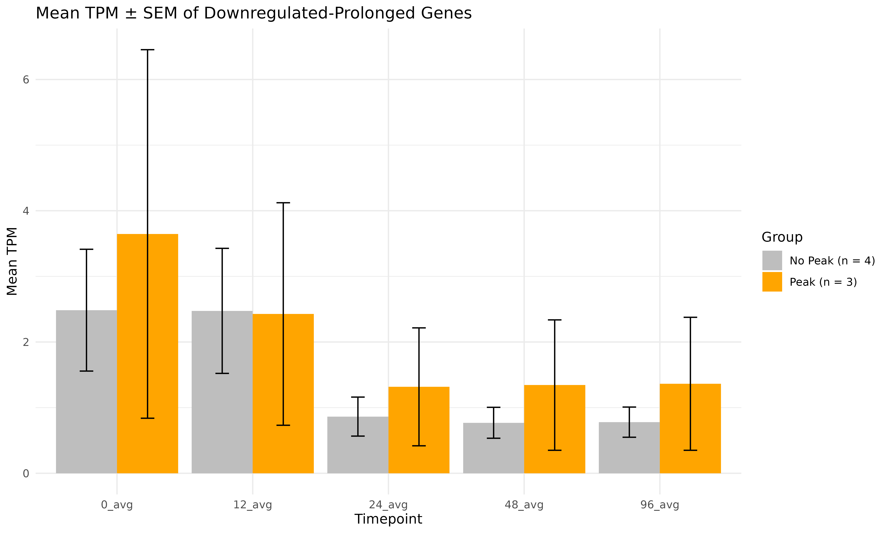

#### Human Results
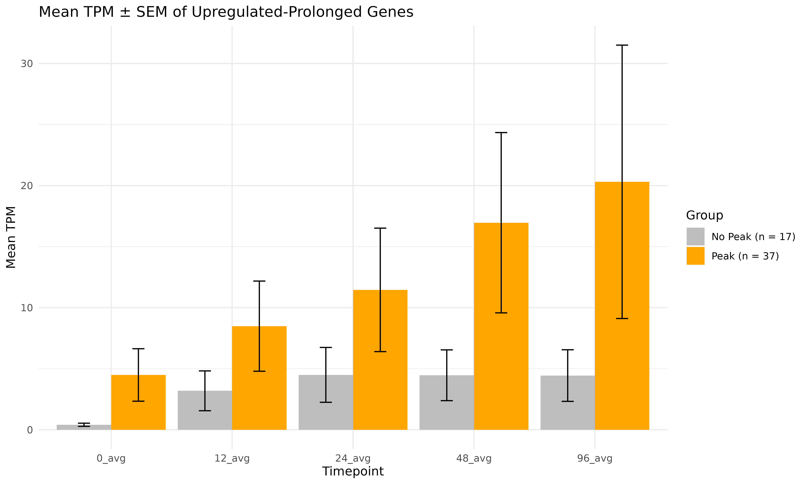

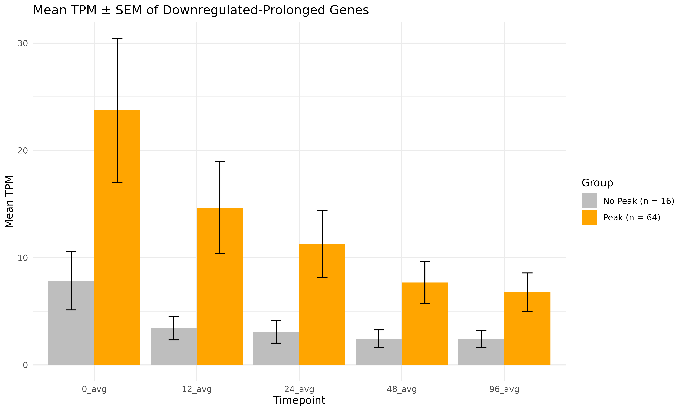

## Section 3: IGV

To identify conserved genes between human and mouse, we examined potential homologs among the prolonged genes from both species. For this, we used the ortholog search tool available in the [FlyBase](https://flybase.org/) database to assess cross-species gene matches. We did not find any gene matches between mouse and human among the genes with both significant regulation and overlapping ATAC-seq peaks.
However, in this seciton we will introduce some important genes were we found either over or under expression after dox treatment, potentially affecting their function. 

### Mouse genes
### Usp26

The [Usp26](https://www.uniprot.org/uniprotkb/Q99MX1/entry) gene has been involved in deubiquitination pathways, making it potentially relevant for gene regulation. There are many transcription factors in the cell, such as  polycomb repressive complex 1 (PRC1), that are in charge of maintaining and regulating epigenetic marks in the genome (Tamburri et al., 2020). Many of these transcription factors, need ubiquitination for their function, making a deubiquitination crucial for this process as well (Mark & Rape, 2021). For example, this gene has been found to be involved in somatic cell reprogramming through the K48 deubiquitination of two protein components of PRC1.

Peaks represent the coverage of sequencing reads across this gene. Note that peaks are higher at 0 and 12 hours, but are lower when 24 hours are reached. They keep beung low until the last time point of 96 hours. Note there are higher expression signals in the nost downstream exon of the Usp26 gene. 

Peaks represent accessible chromatin sites. Samples at 0, 30, 60, 90, 120 and 150 minutes after dox treatment are shown. Note that the epigenetic landscape for this gene seems to be changing overtime, with its higher peak presented at 90 minute after treatment timepoint. This IGV track is showin the accessibility of Usp26 gene in its most upstream exon. Note that this exon is not the same as the one in the RNA seq track.

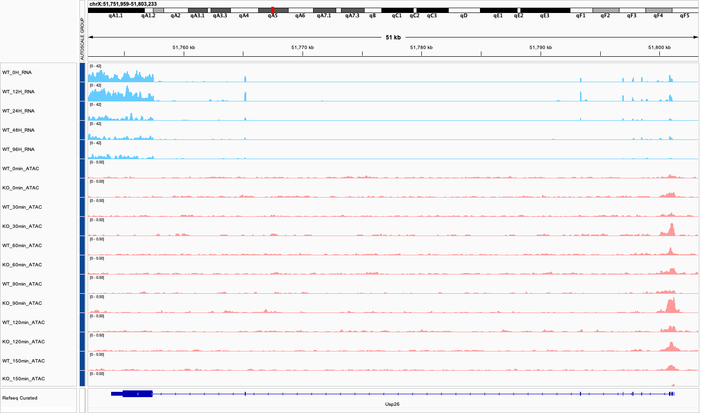
Peaks represent the coverage of sequencing reads across this gene(RNA, blue peaks), and accessible chromatin sites(ATAC, pink peaks).

### Cbr3 

The Carbonyl reductase [NADPH] 3 [(Cbr3)](https://www.uniprot.org/uniprotkb/Q8K354/entry) is an enzyme that uses NADPH to turn harmful carbonyl compounds (especially ortho-quinones) into safer alcohols, possibly protecting cells from damage.
This gene was upregulated in mice after 48 hours and keeps being upregulated for at least 96 hours after dox treatment.

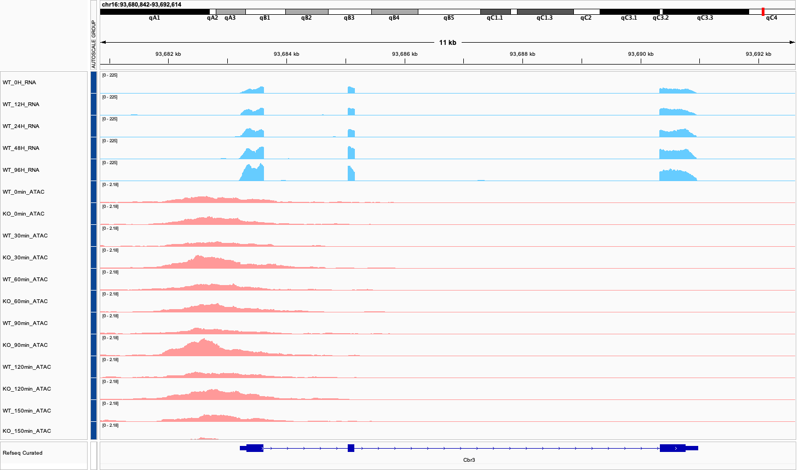
Peaks represent the coverage of sequencing reads across this gene(RNA, blue peaks), and accessible chromatin sites(ATAC, pink peaks). Note that ATAC seq peak coincide with the first exon of the gene, suggesting that this is a promotwr region of the gene, that allows for the transcription of the gene, shown  by the RNA seq peaks. Note that the chromatin landscape does not change over time. Note that the RNA seq peaks are higher in the later time point, suggesting an over expression by 96h after dox treatment.  

### Human genes 

### MAG 

Myelin associated glycoprotein [(MAG)](https://www.uniprot.org/uniprotkb/P20916/entry) is a cell membrane protein crucial for the formation and maintenance of myelin sheaths in the peripheral and central nervous system. Additionally, the absence of this protein leads to diseases such as multiple sclerosis(MS), suggesting an important role in the integrity and adequate function of the nervous system(Sato et al., 1989).

In our analysis, we found that this gene is down-regulated in humans 96 hours after dox treatment, with no detectable ATAC-seq peak at the final time point, suggesting reduced chromatin accessibility and gene activity, hence protein production.This downregulation may compromise nervous system integrity. However, more research needs to be done in the effects of dox in MAG production to draw any relationships.

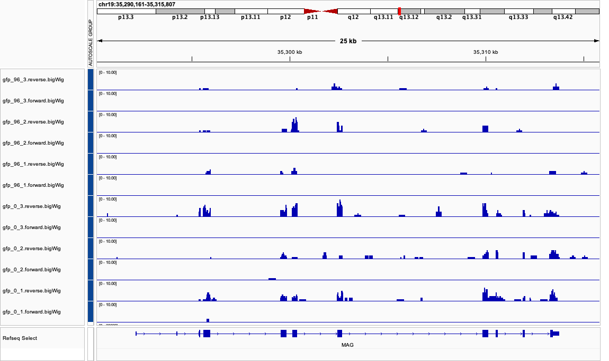
Peaks represent the coverage of sequencing reads across this gene. Only peaks from 0 and 96 hours are shown. Note that RNA-seq signal was higher at the 0-hour timepoint but had diminished by 96 hours, indicating a reduction in gene expression over time.

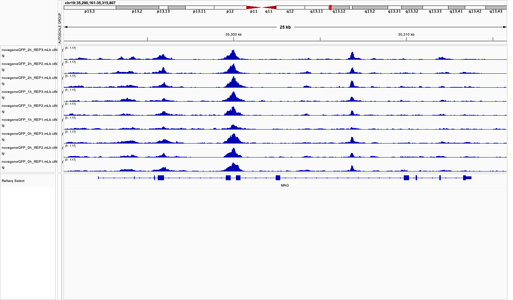

Peaks represent accessible chromatin sites. Samples at 0, 1 and 2-hours timepoints are shown. Note that most exonic regions of this gene present accessibility. However, there is one peak in an intronic region. Note that the epigenetic landscape for this gene does not change overtime. 

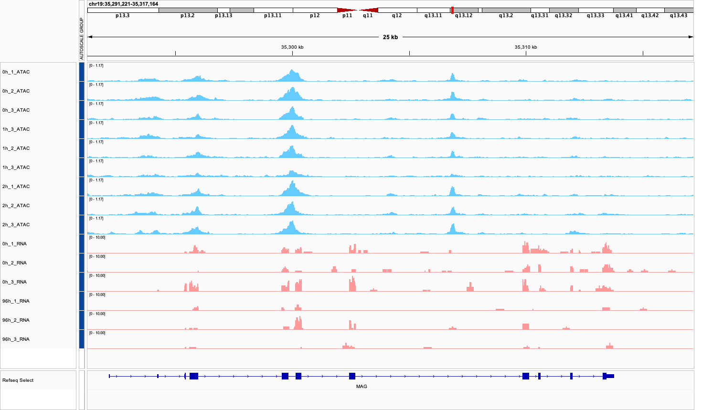

Peaks represent the coverage of sequencing reads across this gene(RNA, blue peaks), and accessible chromatin sites(ATAC, pink peaks).

### AUTS2

The autism susceptibility gene [(AUTS2)](https://www.uniprot.org/uniprotkb/Q8WXX7/entry) is a component of a polycomb group multiprotein, polycomb repressive complex I (PRC1) -like complex (Tamburri et al., 2020). This complexes are required to maintain the transcriptionally repressive state of many genes, including Hox genes, which are crucial throughout development (Gao et al., 2014). Mutations in this gene have been identified in autism patients, and its suppression in zebrafish embryos was observed to cause microcephaly (Beunders et al., 2013). This role suggests relevance in gene regulation, making it an interesting and possibly important gene to further explore the effects of dox treatment. This gene was upregulated and had accessible chromatin in our analysis, suggesting an increased activity after dox treatment, that persisted at least 96 hours. 

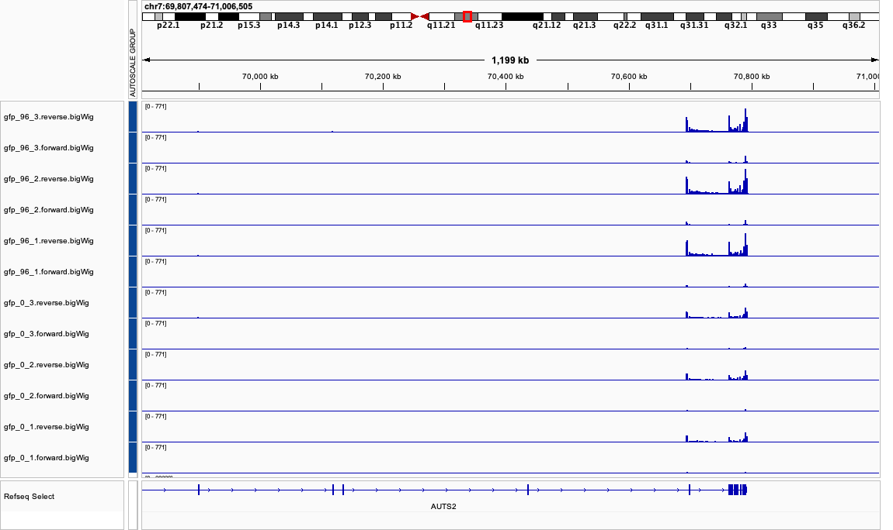
Peaks represent the coverage of sequencing reads across this gene. Only peaks from 0 and 96 hours are shown. Note that RNA-seq signal was diminished at 0-hour timepoint, but higher at the 96-hour timepoint indicating an increased gene expression over time.

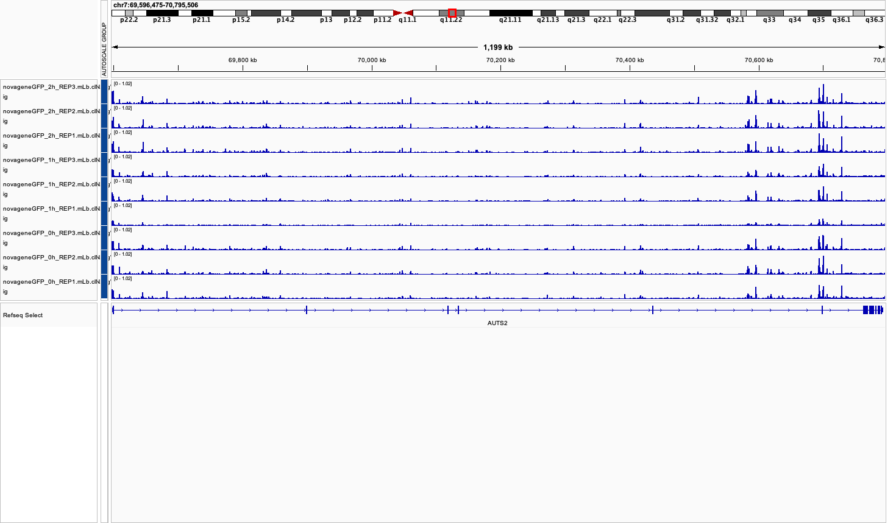
Peaks represent accessible chromatin sites. Samples at 0, 1 and 2-hours timepoints are shown. Note that AUTS2 gene has multiple accessible points. Note that the epigenetic landscape for this gene does not change overtime. 

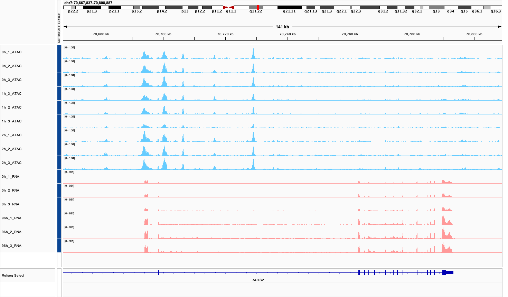

Peaks represent the coverage of sequencing reads across this gene(RNA, blue peaks), and accessible chromatin sites(ATAC, pink peaks).

### NOD1

The Nucleotide-binding oligomerization domain-containing protein 1 [(NOD1)](https://www.uniprot.org/uniprotkb/Q9Y239/entry) is a leucine-rich molecule that can regulate both apoptosis and NF-kappaB activation pathways (Inohara et al., 1999). Given this, it play a crucial role in innate and adaptive immunity by recognizing Gram-negative bacteria and viral double stranded RNA. 
This gene was upregulated and had open chromatin on our analysis, suggesting an overexpression upon dox treatment. The upregultaion of this gene might be generating an excess immune response, perhaps against dox. More research is needed to further explore this speculation. 

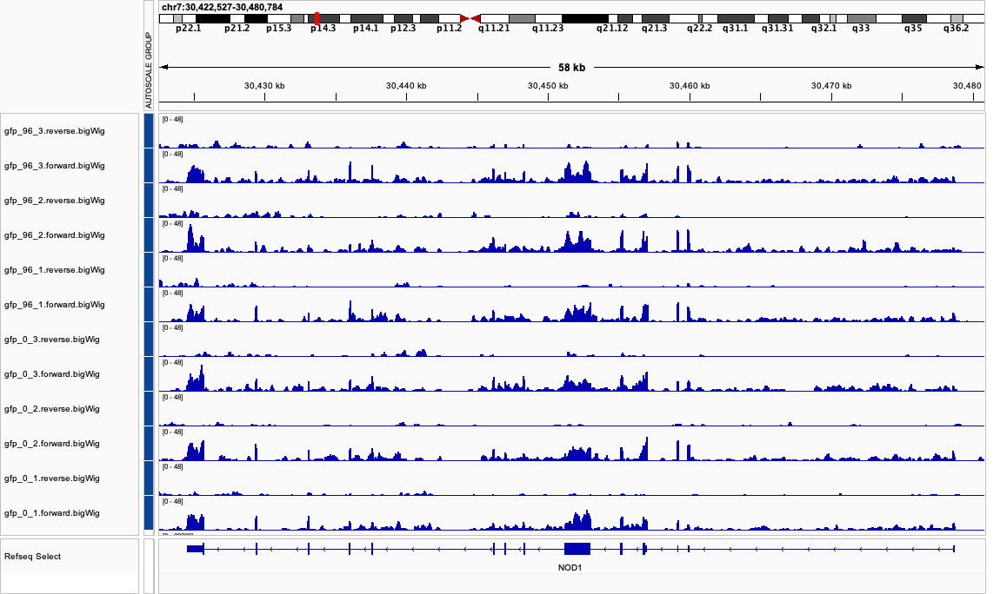
Peaks represent the coverage of sequencing reads across this gene. Only peaks from 0 and 96 hours are shown. Note that RNA-seq signal was diminished at 0-hour timepoint, but peaks are higher at the 96-hour timepoint indicating an increased gene expression over time. 

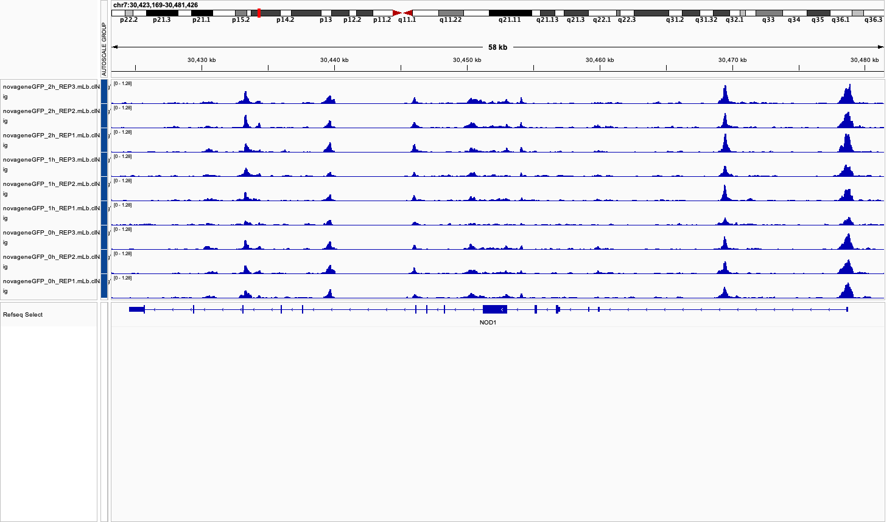

Peaks represent accessible chromatin sites. Samples at 0, 1 and 2-hours timepoints are shown. Note that multiple exons across the NOD1 gene present accessible chromatin throughout all timepoints, especially the most upstream exon. Note that the epigenetic landscape for this gene does not change overtime.   

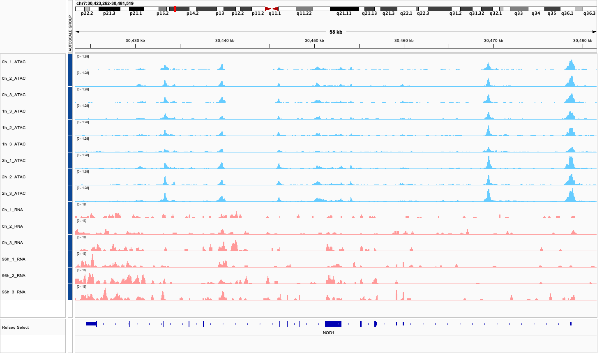
Peaks represent the coverage of sequencing reads across this gene(RNA, blue peaks), and accessible chromatin sites(ATAC, pink peaks).

## References 

Beunders, G., Voorhoeve, E., Golzio, C., Pardo, L. M., Rosenfeld, J. A., Talkowski, M. E., Simonic, I., Lionel, A. C., Vergult, S., Pyatt, R. E., van de Kamp, J., Nieuwint, A., Weiss, M. M., Rizzu, P., Verwer, L. E. N. I., van Spaendonk, R. M. L., Shen, Y., Wu, B., Yu, T., … Sistermans, E. A. (2013).
Exonic deletions in AUTS2 cause a syndromic form of intellectual disability and suggest a critical role for the C terminus. American Journal of Human Genetics, 92(2), 210–220. https://doi.org/10.1016/j.ajhg.2012.12.011

Gao, Z., Lee, P., Stafford, J. M., von Schimmelmann, M., Schaefer, A., & Reinberg, D. (2014). An AUTS2-Polycomb complex activates gene expression in the CNS. Nature, 516(7531), 349–354. https://doi.org/10.1038/nature13921

Inohara, N., Koseki, T., del Peso, L., Hu, Y., Yee, C., Chen, S., Carrio, R., Merino, J., Liu, D., Ni, J., & Núñez, G. (1999). Nod1, an Apaf-1-like activator of caspase-9 and nuclear factor-kappaB. The Journal of Biological Chemistry, 274(21), 14560–14567. https://doi.org/10.1074/jbc.274.21.14560

Mark, K. G., & Rape, M. (2021). Ubiquitin‐dependent regulation of transcription in development and disease. EMBO Reports, 22(4), e51078. https://doi.org/10.15252/embr.202051078

Sato, S., Fujita, N., Kurihara, T., Kuwano, R., Sakimura, K., Takahashi, Y., & Miyatake, T. (1989). cDNA cloning and amino acid sequence for human myelin-associated glycoprotein. Biochemical and Biophysical Research Communications, 163(3), 1473–1480. https://doi.org/10.1016/0006-291X(89)91145-5

Tamburri, S., Lavarone, E., Fernández-Pérez, D., Conway, E., Zanotti, M., Manganaro, D., & Pasini, D. (2020). Histone H2AK119 Mono-Ubiquitination Is Essential for Polycomb-Mediated Transcriptional Repression. Molecular Cell, 77(4), 840-856.e5. https://doi.org/10.1016/j.molcel.2019.11.021

