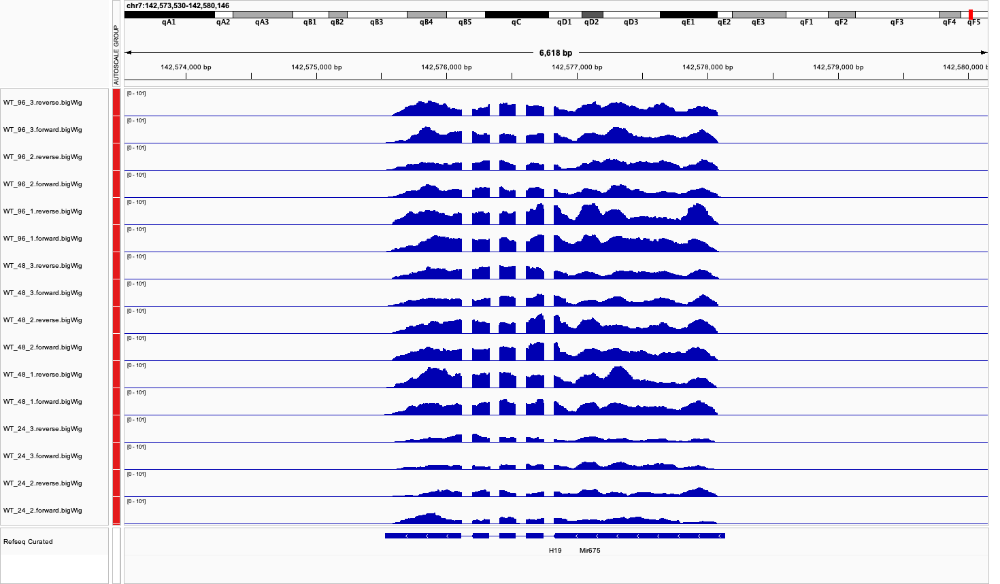

# Introduction
- Provide some intro and background about the project.

# Goals 
- May be a subsection of the introduction. Describe what we want to achieve
  - General analysis of gene expression. Consider repeating the analysis from class but normalizing based on time 0.
  - Compare genes with transient vs prolonged changes in expression after dox induction.
  - Compare nextflow versions (3.14 and 3.18) and different runs for 3.14 (rep1 and rep2) results.

# Methods
- Explain in general the overall idea with RNA-seq analysis

## Bench experiment
- Ask JR about details of the experiment and how much

## Nextflow RNA-Seq pipeline
- Describe roughly the pipeline

## DESeq2 analysis 
- Not sure if its better to define it later but maybe mention some details about DESeq2 here

# RNA-seq differential expression analysis

## Nextflow output
- May describe the results from the nextflow pipeline, some QC plots and the type of files produced. 

## R Analysis (consider a better name)

### Library Imports
```{r setup, include=FALSE}
knitr::opts_chunk$set(warning = FALSE, message = FALSE, echo = TRUE)
library(IRanges)
library(dplyr)
library(tidyr)
library(tibble)
library(readr)
library(ggplot2)
library(purrr)
library(magrittr)
library(pheatmap)
library(textshape)
library(Rcpp)
library(matrixStats)
library(rtracklayer)
library(tidyverse)
library(DESeq2)
library(broom)
library(reshape)
```

### Parameter and path definition
```{r define variables}
COUNTS_PATH      <- "data/NF3-14_rep1/salmon.merged.gene_counts.tsv"
TPM_PATH         <- "data/NF3-14_rep1/salmon.merged.gene_tpm.tsv"
FILTER_TRESHOLD  <- 0
P_VALUE_FILTER   <- 0.05
LOG2_FOLD_FILTER <- 1
```

### Data loading and preprocesing
```{r load counts and get counts filtered}
# Read raw count data and make dictionary mapping gene id with gene name
counts_orig  <- read.table(COUNTS_PATH, header=TRUE, row.names=1)
g2s          <- data.frame(gene_id = rownames(counts_orig), 
                           gene_name = counts_orig[ , 1]) 
write.csv(g2s, "results/g2s.csv")

# Remove gene name column from counts and convert counts to numerical rounded matrix
counts           <- counts_orig %>% select(-gene_name)
counts_matrix    <- as.matrix(counts) 
counts_matrix    <- round(counts_matrix)

# Filter genes with no counts for any of the samples
counts_filtered  <- counts_matrix[rowSums(counts_matrix) > FILTER_TRESHOLD, ]

save(counts_orig, counts, counts_filtered, g2s, file = "results/counts_files.RData")
```

### Metadata preparation
```{r make deseq_samples metadata file for DESeq2 }
# Make a column from the titles of the columns of the counts_matrix table
deseq_samples  <- data.frame(sample_id = colnames(counts))

# Get the time and replicate values from the sample names in deseq_samples
split_values     <- strsplit(deseq_samples$sample_id, "_")
time_values      <- sapply(split_values, function(x) x[[2]])
replicate_values <- sapply(split_values, function(x) x[[3]])

# Add time and replicate values as columns to deseq_samples and factor them
deseq_samples$time_point <- time_values
deseq_samples$replicate  <- replicate_values
deseq_samples$time_point <- factor(deseq_samples$time_point)
deseq_samples$time_point <- factor(deseq_samples$time_point, levels=c("0","12","24","48","96"))
deseq_samples$replicate  <- factor(deseq_samples$replicate)

# Testing whether sample sheet and counts are arranged properly 
stopifnot(all(colnames(counts) == rownames(deseq_samples$sample_id)))

save(deseq_samples, file = "results/deseq_samples.RData")
```

### Differential expression analysis
```{r run DESeq and obtain rlogs}
# Prepare DESeq dataset
dds <- DESeqDataSetFromMatrix(countData = counts_filtered,
                              colData = deseq_samples,
                              design = ~ time_point) 

# Run DESeq and get the names for the comparisons
dds            <- DESeq(dds)
results_names  <- resultsNames(dds)
results_names  <- results_names[results_names != "Intercept"]
results_names <- c(results_names, "time_point_24_vs_12", "time_point_48_vs_24", "time_point_96_vs_48")


# Regularized Log transformation (rlog) stabilizes variance for downstream visualization or clustering. (not sure if need to include)
#rlog_counts <- rlog(dds, blind = TRUE)
#rlog_counts_matrix <- assay(rlog_counts)
#write_rds(rlog_counts_matrix, "results/rlog_counts.rds")

save(dds, file = "results/dds.RData")
```

```{r obtain results for all comparisons}
# Create empty df to store results values
results <- data.frame("gene_id" = character(), 
                      "baseMean" = numeric(), 
                      "log2FoldChange" = numeric(), 
                      "lfcSE" = numeric(),
                      "stat" = numeric(),
                      "pvalue" = numeric(),
                      "padj" = numeric(),
                      "gene_name" = character(),
                      "result_name" = character())

# Loop to get the results of each comparison from dds object and make main res_df with all of them
for(i in 1:length(results_names)) {
  results_name <- results_names[i] # get time comparison i
  results_name <- strsplit(results_name, "_")
  res <- results(dds, contrasts=c("time_point","result_name[3]","result_name[4]")) # get DESeq results for time comparison i
  # Temporary df to store the results for each comparison i
  tmp_res_df <- res %>% as.data.frame() %>% 
    rownames_to_column("gene_id") %>% merge(g2s) %>% mutate(result_name = results_name)
  # Add the temporary df to the main res_df for each comparison i
  results <- bind_rows(results, tmp_res_df)
}
```


### Filtering and visualization
```{r filtering results}
# Filter based on p-value < 0.05 and log2 fold change > 1
filtered_results <- results %>%
  filter(padj < P_VALUE_FILTER, abs(log2FoldChange) > LOG2_FOLD_FILTER)

# Get all gene names that are significant (drop gene name repetitions)
filtered_genes <- as.data.frame(filtered_results$gene_name, collapse = "\n")
filtered_genes <- unique(filtered_genes)
colnames(filtered_genes)[1] <- "gene_name"

# Now let's write this out and do gene enrichment analysis
write.table(filtered_genes["gene_name"], row.names = FALSE, col.names = FALSE, "results/filtered_genes.csv")

save(results, filtered_results, filtered_genes, file = "results/DESeq2_results.RData")

# May wanna take a look at these genes. Start at: https://maayanlab.cloud/Enrichr/
```

```{r filtered results distributions}

# Distribution of baseMean, lfcSE, p-values and fold change
#hist(filtered_results$baseMean, xlim = c(0, 10000), breaks = 500) # May remove this plot
#hist(filtered_results$lfcSE, xlim = c(0,5), breaks = 100) # May remove this histogram as well
hist(filtered_results$padj, xlim = c(0,P_VALUE_FILTER ), breaks = 50)
hist(filtered_results$log2FoldChange, xlim = c(-5, 5), breaks = 1000)

# T-test comparing baseMean expression of all genes vs filtered genes
basemean_all_genes <- median(results$baseMean)
basemean_fil_genes <- median(filtered_results$baseMean)
t.test(results$baseMean, filtered_results$baseMean)

# Intersect by gene_name filtered results table and raw counts
counts_filtered_genes <- counts_orig[filtered_results$gene_id,]
# TODO delete repetitive instances of genes
```

### TPM analysis
```{r, load tpm data and filter}
# Read raw tpm data and delete gene name column
tpm_orig  <- read.table(TPM_PATH, header=TRUE, row.names=1)
tpm       <- tpm_orig %>% select(-gene_name)

# Filter genes with no counts for any of the samples
tpm_filtered <- tpm[rowSums(tpm) > FILTER_TRESHOLD, ]
```

```{r calculate avg and sd for tpms}
# Loop to calculate avg and sd for replicates at a given time point
time_points <- c("0", "12", "24", "48", "96")
avg_and_sd_values <- list()
for (tp in time_points) {
  cols <- grep(paste0("WT_", tp, "_"), colnames(tpm_filtered))
  avg  <- rowMeans(tpm_filtered[, cols])
  sd   <- apply(tpm_filtered[, cols], 1, sd)
  sd   <- data.frame(sd)
  combined <- cbind(avg, sd)
  avg_and_sd_values <- c(avg_and_sd_values, list(combined))
}

# Convert the list to a data frame and add column names for the respective timepoint
avg_and_sd_values <- do.call(cbind,  avg_and_sd_values)
colnames(avg_and_sd_values) <- paste0(rep(time_points, each = 2), c("_avg", "_sd"))
avg_and_sd_values <- as.data.frame(avg_and_sd_values) %>% rownames_to_column("gene_id") %>% merge(g2s)


save(tpm_orig, tpm_filtered, avg_and_sd_values, file = "results/tpm_results.RData" )
```

### Image analysis
```{r drafts for ggplots}
# Delete enviroment and load counts and tpm data
load("results/DESeq2_results.RData")
load("results/tpm_results.RData")

# Volcano plot for log fold change vs padj. TRUE color may be genes worth looking into.
ggplot(filtered_results, aes(x = log2FoldChange, y = padj, color = (padj<0.01 & abs(log2FoldChange) > 10 ))) +
  facet_wrap(result_name ~ .) +
  geom_point()

# Histogram for log fold change vs padj
ggplot(filtered_results, aes(x = log2FoldChange, fill = result_name)) +
  facet_wrap(result_name ~ .) +
  geom_histogram(bins = 50) 
```

```{r more code not to show, include=FALSE}
# Distribution for log fold change vs padj
#ggplot(filtered_results, aes(x = log2FoldChange , fill = padj<0.01, color = padj<0.01)) +
  #facet_wrap(result_name ~ .) +
  #geom_density(alpha = 0.1)

# 2D density
#ggplot(filtered_results, aes(x = log2FoldChange, y = lfcSE)) +
  #geom_point() +
  #xlim(-5,5) +
  #geom_density_2d() 

#ggplot(filtered_results, aes(x = padj, y = pvalue)) +
  #geom_point() +
  #geom_abline(slope = 1, intercept = 0) +
  #geom_smooth(method = "lm")

#lm_fit <- lm(filtered_results$padj ~ filtered_results$pvalue)
#summary(lm_fit)
#summary(filtered_results$padj)
#lm_df <- tidy(lm_fit)

#ggplot(filtered_results, aes(x = padj, y = pvalue)) +
  #geom_point() +
  #geom_abline(slope = 1/(lm_df$estimate[[2]]))

# Bar plots
#ggplot(filtered_results, aes(x = result_name, y = baseMean)) +
  #geom_bar(stat = "identity")

#sum_basemean <- filtered_results %>%
  #filter(result_name == "time_point_12_vs_0") %>%
  #summarise(sum_basemean = sum(baseMean))


#ggplot(filtered_results, aes(x = result_name, y = baseMean)) +
  #geom_point() +
  #stat_summary(fun = "mean",
               #color = "red",
               #shape = 1,
               #size = 2)


#ggplot(filtered_results, aes(x = pvalue, y =padj, color = padj < 0.01)) +
  #geom_point()+
  #scale_x_continuous() +
  #scale_color_brewer(palette = "Set1") 


# Now let's pick a few genes of interest to plot.
genes <- c("Pgk1-rs7", "Gm13691", "Gm13698", "Spink1", "Pappa", "H3c11")
gene_values <- filtered_results %>%
  filter(gene_name %in% genes)

# Facet grid
ggplot(gene_values, 
       aes(x = log2FoldChange, y = padj )) +
  facet_grid(gene_name ~ .) + 
  geom_point()

ggplot(gene_values, 
       aes(x = log2FoldChange, y = padj )) +
  facet_grid(gene_name ~ result_name) + 
  geom_point()

# Facet wrap
ggplot(gene_values, 
       aes(x = log2FoldChange, y = padj )) +
  facet_wrap(gene_name ~ .) + 
  geom_point()

ggplot(gene_values, 
       aes(x = log2FoldChange, y = padj )) +
  facet_wrap(gene_name ~ result_name) + 
  geom_point()

ggplot(gene_values, 
       aes(x = log2FoldChange, y = padj )) +
  facet_wrap(gene_name ~ ., nrow = 2, ncol = 3) + 
  geom_point()

ggplot(gene_values, 
       aes(x = log2FoldChange, y = padj )) +
  facet_wrap(gene_name ~ ., nrow = 2, ncol = 3, scales = "free") + 
  geom_point()
  

# Polar coordinates
ggplot(filtered_results, aes(x = result_name)) +
  geom_bar() +
  coord_polar()

ggplot(filtered_results) +
  geom_bar(aes(x = result_name)) +
  coord_polar(theta = 'y')


ggplot(filtered_results, aes(x = log2FoldChange)) +
  geom_density(alpha = 0.2, color = "#424242", fill = "#424242") +
  theme_grey() +
  xlab(expression("log2fold change")) +
  ylab(expression("Density")) +
  ggtitle("log2fold change",
          subtitle = "genes regulated by dox and time")

```
## IGV Results

This are the timepoint tracks for gene H19 using the GRCm38/mm10 genome

## Future directions
Pretty cool video on DESeq2 analysis:
https://www.youtube.com/watch?v=NGbZmlGLG5w&t=264s

Ideas of plots to include:
- Circos plot
  - Needs to know where the gene is located so need to use biomaRt to get data from ensembl and get the gene information (it looks a bit complicated)
  - Will need to save a csv file with Gene ID, chromosome name, start position, end position + rows in results from DESeq2
  - Plots can be made in Circa (easier) or through bash (harder)