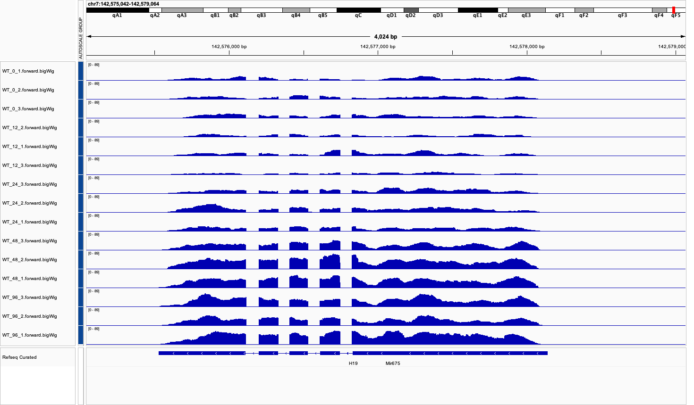

#Results

After performing DESeq2, we found that from the 55401 total genes, 794 were significantly expressed genes. From our significantly expressed genes, we generated a list of prolonged genes that represent candidates that were up or down regulated after Dox treatment at an early time point (12 or 24 hours) and maintained their trend until the 96 hour time point (last collected). A total of 27 prolonged genes were found. We looked at prolonged up or down regulated genes, because if their levels are high or low throughout all time points, they might be causing a permanent change in important genes. 

##Heatmaps

**Heatmap of log2 transformed tpm values for all significant genes.** Note the gene expression patterns of the sample clusters formed A total of 794 genes were significantly down or upregulated in mice after Dox treatment at any given time point. Note that groups are formed between replicates of the same time point. Samples at 0 and 96 hours form a sister group, suggesting similarities in expression patterns compared to other time point samples. 

**Heatmap of log2 transformed tpm values of prolonged genes.** A total of 27 genes had a prolonged expression trend up until last sampled time point of 96 hours after Dox treatment. Note that in this case, time points 0 and 12 grouped together, suggesting similarity in expression in initial time points. However, as time point increases, samples form a different group, with samples from 24, 48 and 96 hours.

##IGV

We explored prolonged genes roles in the cell by looking at their gene ontologies (GO), and we found three genes with strong evidence of important regulatory roles in mice, H19, Usp26, and Ier3. From those three genes H19 had prolonged up regulation, while Ier3 and Usp26 had prolonged down regulation. Their prolonged change in expression suggests that these genes might be changing permanently, compromising cell integrity by changing regulatory pathways. However, additional time points should be sampled to test this hypothesis. 

###H19 

This gene is a long non-coding RNA (lncRNA) gene. Strong evidence suggests that this gene is involved in the control of embryonic growth. In addition, it has been found to regulate nine genes of an imprinted gene network. Its prolonged up regulation after Dox treatment suggests a potential role in maintaining cellular processes related to growth and development, possibly by modulating the activity of imprinted genes that are critical for cell differentiation and tissue patterning. 

**IGV track with peaks of H19 gene.** Peaks represent the coverage of sequencing reads across this gene. Note that peaks are low at 0 and 12 hours, but start getting higher at 24. By the time they have reached 48 hours, they are high and they keep this high trend until the last sampled time point of 96 hours. 

###Ier3

This gene may play a role in the ERK pathway for multiple cellular processes, such as growth,  proliferation, differentiation, and survival. This role suggests relevance in gene regulation, making it an interesting and possibly important gene to further explore the effects of Dox treatment. Dox might be affecting the normal function of this gene by down regulating its expression at least 96 hours after treatment. 

**IGV track with peaks of Ier3 gene.** Peaks represent the coverage of sequencing reads across this gene. Note that peaks are higher in the beginning at 0 hours, and they decrease as time increases. They remain low until the last time point sampled of 96 hours. 

###Usp26

This gene has been involved in deubiquitination pathways, making it potentially relevant for gene regulation. There are many transcription factors in the cell, such as PRC1, that are in charge of maintaining and regulating epigenetic marks in the genome. Many of these transcription factors, need ubiquitination for their function, making a deubiquitination crucial for this process as well. For example, this gene has been found to be involved in somatic cell reprogramming through the K48 deubiquitination of two protein components of polycomb repressive complex 1 (PRC1).

**IGV track with peaks of Usp26 gene.** Peaks represent the coverage of sequencing reads across this gene. Note that peaks are higher at 0 and 12 hours, but are lower when 24 hours are reached. They keep beung low until the last time point of 96 hours.

