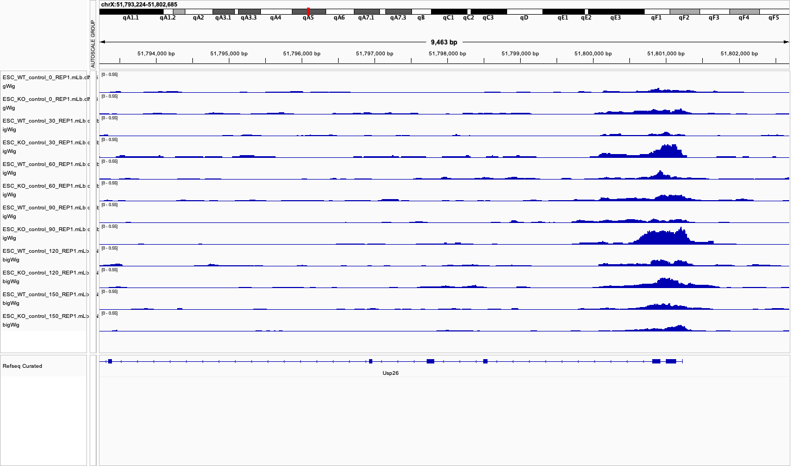

```{r setup, include=FALSE}
knitr::opts_chunk$set(warning = FALSE, message = FALSE, echo = TRUE)
library(IRanges)
library(dplyr)
library(tidyr)
library(tibble)
library(readr)
library(ggplot2)
library(purrr)
library(magrittr)
library(pheatmap)
library(textshape)
library(Rcpp)
library(matrixStats)
library(rtracklayer)
library(tidyverse)
library(DESeq2)
library(broom)
library(reshape)
library(ggrepel)
library(ggdendro)
library(circlize)
library(stringr)
source(file = "utils/proccess_files.R")
source(file = "utils/plots.R")
source(file = "utils/ATAC_functions.R")
```

# SECTION 1: RNAseq analysis
Understanding the temporal dynamics of gene expression is crucial for deciphering complex biological processes like stem cell differentiation or response to stimuli. This project utilizes a doxycycline (dox)-inducible system in stem cells, where dox triggers gene expression via the rtTA-TRE mechanism. While powerful, concerns exist that dox itself might exert off-target effects on the transcriptome. Leveraging Dr. Rinn's lab RNA-seq dataset spanning five time points (0, 12, 24, 48, 96 hours) with replicates, this analysis aims to: 

1) Identify genes significantly regulated following dox administration. 
2) Characterize the temporal profiles of these regulated genes, distinguishing between transient and sustained responses. 
3) Investigate the role, significance, and chromosomal location of these genes. 

We employ the nf-core/rnaseq pipeline for data processing and DESeq2 for differential expression analysis, providing a practical application of bioinformatics skills to time-course data exploration.

## 1.1) Data preprocessing
To filter genes that significantly change from the zero time point (no dox)

### Parameters and paths definition
```{r define variables and paths}
# Set species parameter - set to either "mouse" or "human"
SPECIES          <- "mouse"  # Change to "human" for human data

# Analysis parameters
FILTER_TRESHOLD  <- 0
P_VALUE_FILTER   <- 0.01
LOG2_FOLD_FILTER <- 1
```

```{r load data, include=FALSE}
# Paths for data files
COUNTS_PATH      <- ifelse(SPECIES == "mouse", 
                          "data/NF3-18/salmon.merged.gene_counts.tsv", 
                          "/scratch/Shares/rinnclass/MASTER_CLASS/DATA/human_rnaseq/salmon.merged.gene_counts.tsv")
TPM_PATH         <- ifelse(SPECIES == "mouse", 
                          "data/NF3-18/salmon.merged.gene_tpm.tsv", 
                          "/scratch/Shares/rinnclass/MASTER_CLASS/DATA/human_rnaseq/salmon.merged.gene_tpm.tsv")
GTF_PATH         <- ifelse(SPECIES == "mouse", 
                          "/scratch/Shares/rinnclass/MASTER_CLASS/DATA/genomes/Mus_musculus/Gencode/M25/gencode.vM25.annotation.genes.gtf",
                          "/scratch/Shares/rinnclass/MASTER_CLASS/DATA/genomes/Homo_sapiens/Gencode/v38/gencode.v38.annotation.gtf")
PEAK_PATH         <- ifelse(SPECIES == "mouse",
                            "/scratch/Shares/rinnclass/MASTER_CLASS/DATA/mouse_atacseq",
                            "/scratch/Shares/rinnclass/MASTER_CLASS/DATA/human_atacseq")
RESULTS_PATH     <- ifelse(SPECIES == "mouse", 
                          "results/mouse",
                          "results/human")

dir.create("results", showWarnings = FALSE)
dir.create(file.path("results", SPECIES), showWarnings = FALSE)

# Define prefixes for column names based on species
SAMPLE_PREFIX    <- ifelse(SPECIES == "mouse", "WT", "gfp") 
```


### Loading and preproccesing count
```{r pre-proccess counts and tpm files}
# Read raw data and make dictionary mapping gene id with gene name
counts_orig  <- read.table(COUNTS_PATH, header=TRUE, row.names=1)
g2s          <- data.frame(gene_id = rownames(counts_orig), 
                           gene_name = counts_orig[ , 1]) 

# Remove gene name column from counts and convert counts to numerical rounded matrix
counts           <- counts_orig %>% select(-gene_name)

# Filter genes with no counts for any of the samples
counts_filtered <- counts %>% 
  as.matrix() %>% 
  round() %>% 
  .[rowSums(.) > FILTER_TRESHOLD, ]
```


### DESeq2 analysis for counts
```{r make deseq_samples metadata file for DESeq2 }
# Make a column from the titles of the columns of the counts_matrix table
deseq_samples  <- data.frame(sample_id = colnames(counts))

# Get the time and replicate values from the sample names in deseq_samples
split_values     <- strsplit(deseq_samples$sample_id, "_")
time_values      <- sapply(split_values, function(x) x[[2]])
replicate_values <- sapply(split_values, function(x) x[[3]])

# Add time and replicate values as columns to deseq_samples and factor them
deseq_samples$time_point <- time_values
deseq_samples$replicate  <- replicate_values
deseq_samples$time_point <- factor(deseq_samples$time_point, levels=c("0","12","24","48","96"))
deseq_samples$replicate  <- factor(deseq_samples$replicate, levels =c("1","2","3"))
deseq_samples <- drop_na(deseq_samples)

# Remove extra timepoints and replicates (counts)
keep_cols <- deseq_samples$sample_id
counts_filtered  <- counts_filtered[, colnames(counts_filtered) %in% keep_cols, drop = FALSE]

# Testing whether sample sheet and counts are arranged properly 
stopifnot(all(colnames(counts) == rownames(deseq_samples$sample_id)))

# Prepare DESeq dataset and run DESea2
dds <- DESeqDataSetFromMatrix(countData = counts_filtered,
                              colData = deseq_samples,
                              design = ~ time_point) 
dds <- DESeq(dds)

```

```{r PCA analysis of the samples}
pca_plot <- plot_pca(dds, intgroup=c("time_point", "replicate"))
ggsave(file.path(RESULTS_PATH, "pca_plot.png"), pca_plot, width = 8, height = 6, dpi = 300)
print(pca_plot)
```

### Obtaining and filtering count results
```{r obtain count results for all count comparisons and filter}
# Define the comparisons
comparison_list <- list(
  # Time points against baseline
  time_12_vs_0 = c("time_point", "12", "0"),
  time_24_vs_0 = c("time_point", "24", "0"),
  time_48_vs_0 = c("time_point", "48", "0"),
  time_96_vs_0 = c("time_point", "96", "0"),
  # Time series comparisons
  time_24_vs_12 = c("time_point", "24", "12"),
  time_48_vs_24 = c("time_point", "48", "24"),
  time_96_vs_48 = c("time_point", "96", "48")
)

# Create empty df to store results values
results <- tibble(
  gene_id = character(0),
  baseMean = numeric(0),
  log2FoldChange = numeric(0),
  lfcSE = numeric(0),
  stat = numeric(0),
  pvalue = numeric(0),
  padj = numeric(0),
  gene_name = character(0),
  comparison = character(0)
)

# Process all comparisons
for (comp_name in names(comparison_list)) {
  comp_result <- process_comparison(
    dds_obj = dds,
    comparison_params = comparison_list[[comp_name]],
    comparison_name = comp_name,
    gene_map = g2s
  )
  if (!is.null(comp_result)) {
    results <- bind_rows(results, comp_result)
  }
}

# Filter based on p-value and log2fold changes defined at top
filtered_results <- results %>%
  filter(padj < P_VALUE_FILTER, abs(log2FoldChange) > LOG2_FOLD_FILTER)

# Get unique gene names that are significant
filtered_genes <- filtered_results %>%
  select(gene_name) %>%
  distinct()

save(results, filtered_results, filtered_genes, 
     file=file.path(RESULTS_PATH, "results_counts.RData"))

```

### Obtaining and filtering tmp results
```{r load tpm data, filter and calculate avg and sd for tpms}
# Read raw tpm data and delete gene name column
tpm_orig  <- read.table(TPM_PATH, header=TRUE, row.names=1)
tpm       <- tpm_orig %>% select(-gene_name)

# Filter genes with no counts for any of the samples
tpm_filtered <- tpm[rowSums(tpm) > FILTER_TRESHOLD, ]

# Remove extra timepoints and replicates (tpm)
tpm_filtered <- tpm_filtered[, colnames(tpm_filtered) %in% keep_cols, drop = FALSE]

# Calculate average and standard deviation for replicates at each time point
time_points <- c("0", "12", "24", "48", "96")

# Use map to process each time point and bind the results
avg_and_sd_values <- time_points %>%
  map_dfc(function(tp) {
    # Find columns for this time point - adapt for different column naming patterns
    cols <- grep(paste0("^", SAMPLE_PREFIX, "_", tp, "_"), colnames(tpm_filtered), value = TRUE)
    
    # Calculate mean and sd across replicates
    data.frame(
      avg = rowMeans(tpm_filtered[, cols]),
      sd = apply(tpm_filtered[, cols], 1, sd)
    ) %>% 
    # Rename columns to include time point
    setNames(paste0(tp, c("_avg", "_sd")))
  }) %>% 
  # Add gene identifiers and merge with gene symbols
  rownames_to_column("gene_id") %>% 
  merge(g2s)

save(tpm_filtered, avg_and_sd_values, file = file.path(RESULTS_PATH, "results_tpm.RData"))

```


### Distribution of filtered results
```{r filtered counts statistics distributions}
plot_count_distributions(
  filtered_results,
  output_file = file.path(RESULTS_PATH, "counts_distributions.png")
)

# Use the function with your avg_and_sd_values
plot_tpm_distributions(
  avg_sd_df = avg_and_sd_values,
  output_file = file.path(RESULTS_PATH, "tpm_distributions.png")
)
```

### Volcano plots
```{r volcano plots} 
# Baseline comparisons
baseline_comparisons <- c("time_12_vs_0", "time_24_vs_0", "time_48_vs_0", "time_96_vs_0")
plot_baseline <- create_volcano_plot(
  results,
  p_value_filter = P_VALUE_FILTER,
  log2_fold_filter = LOG2_FOLD_FILTER,
  comparisons = baseline_comparisons,
  plot_title = paste0("Volcano Plots (", toupper(SPECIES), "): Comparisons vs Baseline"),
  output_file = file.path(RESULTS_PATH, "volcano_baseline.png")
)

# Time series comparisons
timeseries_comparisons <- c("time_12_vs_0", "time_24_vs_12", "time_48_vs_24", "time_96_vs_48")
plot_timeseries <- create_volcano_plot(
  results,
  p_value_filter = P_VALUE_FILTER,
  log2_fold_filter = LOG2_FOLD_FILTER,
  comparisons = timeseries_comparisons,
  plot_title = paste0("Volcano Plots (", toupper(SPECIES), "): Sequential Time Comparisons"),
  output_file = file.path(RESULTS_PATH, "volcano_timeseries.png")
)
```

## 1.2) Gene selection
To identify and visualize prolonged and transient expression patterns from significant gene expression dynamics after dox induction

```{r clean env and load data Deseq/tpm, include=FALSE}
rm(list = setdiff(ls()[!sapply(mget(ls(), .GlobalEnv), is.function)], c("P_VALUE_FILTER", "RESULTS_PATH", "PEAK_PATH", "SPECIES", "g2s", "SAMPLE_PREFIX", "GTF_PATH")))
load(file.path(RESULTS_PATH, "results_counts.RData"))
load(file.path(RESULTS_PATH, "results_tpm.RData"))

```

### Classifying genes by their differential expression dynamics
Find genes that hold differential expression up to the end time point (96 hours)
```{r classification and visualization of differential gene expression}
# Extract unique gene IDs from the filtered results and create a data frame
sig_gene <- as.data.frame(unique(filtered_results$gene_id))  # Get unique gene IDs
names(sig_gene) <- "gene_id"  # Rename the column to "gene_id"

# Subset the data frame containing TPM values
tpm_filtered$gene_id <- rownames(tpm_filtered)
rownames(tpm_filtered) <- NULL
sig_gene_tpm_all <- inner_join(tpm_filtered, sig_gene, by = "gene_id")
sig_gene_tpm_all <- merge(sig_gene_tpm_all, g2s)  # Merge with gene-to-symbol mapping (g2s)

# Categorize genes into expression groups
gene_groups <- categorize_gene_expression(filtered_results)
gene_groups_df <- data.frame(
  gene_name = c(gene_groups$change_at_12_to_end, 
               gene_groups$change_at_24_to_end, 
               gene_groups$change_at_48_to_end),
  change_from = c(rep("12", length(gene_groups$change_at_12_to_end)),
                 rep("24", length(gene_groups$change_at_24_to_end)),
                 rep("48", length(gene_groups$change_at_48_to_end)))
)

# Prepare TPM data for plotting genes of interest by merging with genes of interest
selected_tpm <- merge(sig_gene_tpm_all, gene_groups_df)

# Dynamically generate column names for 0h and 96h triplicates
t0_cols <- paste0(SAMPLE_PREFIX, "_0_", 1:3)
t96_cols <- paste0(SAMPLE_PREFIX, "_96_", 1:3)

# Apply function to each row/gene
stat_df <- do.call(rbind, apply(selected_tpm, 1, calculate_stats))
selected_tpm <- cbind(selected_tpm, stat_df)

# Adjust p-values for multiple testing (Benjamini-Hochberg)
selected_tpm$adjusted_pvalue <- p.adjust(selected_tpm$pvalue, method = "BH")

# Get significant results
significant_genes <- selected_tpm[selected_tpm$adjusted_pvalue < P_VALUE_FILTER, ]
genes_of_interest <- significant_genes %>% select(gene_name, change_from, tpm_log2fc)
genes_of_interest <- genes_of_interest[order(genes_of_interest$change_from),]

# Get transient genes
transient_genes <- filtered_genes[!(filtered_genes$gene_name %in%
                                      genes_of_interest$gene_name),]

# Save to csv file
write_csv(genes_of_interest, file.path(RESULTS_PATH, "prolonged_gene_list.csv"))

print(paste("Number of genes with expression sustained until the end:",
            length(genes_of_interest$gene_name)))

print(paste("Number of genes exhibiting transient expression:",
            length(transient_genes$gene_name)))

```

### Heatmaps
```{r heatmaps}
# Prepare data for the heatmap of all significant genes
rownames(tpm_filtered) <- tpm_filtered$gene_id
tpm_filtered$gene_id <- NULL
all_sig_genes_data <- prepare_heatmap_data(
  tpm_matrix = tpm_filtered,
  gene_symbol_map = g2s,
  gene_filter = filtered_genes$gene_name
)

# Generate heatmap for all significant genes
all_genes_heatmap <- plot_gene_heatmap(
  data_matrix = all_sig_genes_data$numeric_matrix,
  title = paste0("Heatmap of Log2-Transformed TPM Values for All Significant Genes (", 
                toupper(SPECIES), ")"),
  show_gene_names = FALSE,
  output_file = file.path(RESULTS_PATH, "heatmap_sig_genes.png")
)
# Prepare data for the heatmap of prolonged genes
prolonged_genes_data <- prepare_heatmap_data(
  tpm_matrix = tpm_filtered,
  gene_symbol_map = g2s,
  gene_filter = genes_of_interest$gene_name
)

# Generate heatmap for prolonged genes
prolonged_genes_heatmap <- plot_gene_heatmap(
  data_matrix = prolonged_genes_data$numeric_matrix,
  title = paste0("Heatmap of Log2-Transformed TPM Values of Prolonged Genes (", 
                toupper(SPECIES), ")"),
  show_gene_names = TRUE,
  output_file = file.path(RESULTS_PATH, "heatmap_prolonged_genes.png")
)
```

## SECTION 2: ATACseq analysis
To determine if chromatin accessibility changes due to dox exposure in stem cells.
We have performed a time course series of experiments measuring chromatin accessibility
(ATACseq peaks) upon exposure to dox. These are 0, 30, 60, 90, 120, 150 minutes.
Each time point has a replicate. The fastq sequencing files were processed by the
NF_CORE ATACseq pipeline v-2.12 (https://nf-co.re/atacseq/2.1.2/).

```{r clean env and load data ATAC, include=FALSE}
rm(list = setdiff(ls()[!sapply(mget(ls(), .GlobalEnv), is.function)], c("P_VALUE_FILTER", "RESULTS_PATH", "PEAK_PATH", "SPECIES", "g2s", "SAMPLE_PREFIX", "GTF_PATH")))
load(file.path(RESULTS_PATH, "results_counts.RData"))
load(file.path(RESULTS_PATH, "results_tpm.RData"))
genes_of_interest <- read.csv(file.path(RESULTS_PATH, "prolonged_gene_list.csv"), header = TRUE)

```

### Loading in ATACseq peak files with custom function import_peaks (list of GRanges output)
```{r loading in peak files to list of GRanges}
# creating a file list also needed for import_peaks function to get sample name associated with file
fl <- list.files(PEAK_PATH, full.names = TRUE, pattern = ".broadPeak")

# running import_peaks
my_peaks <- import_peaks(PEAK_PATH)

# finding consensus peaks among replicates
my_consensus_peaks <- find_consensus_peaks(my_peaks)

# run find_common_peaks function
common_peaks <-  suppressWarnings(find_common_peaks(my_consensus_peaks))

print("here are the number of peaks for each sample")
print(num_consensus_peaks <- sapply(my_consensus_peaks, length) %>% as.data.frame)
```


### Peaks that are unique to dox and non-dox conditions
Using find_common_overlaps peaks that are specific to dox or non-dox
will be identified.

Non-dox samples
```{r non-dox atac peaks, dependson="previous_chunk"}

# common peaks in non-dox (0 time point)
non_dox_samples <- names(my_consensus_peaks)[c(grep("_0", names(my_consensus_peaks)))]
non_dox_peaks <- my_consensus_peaks[non_dox_samples]
if (length(non_dox_samples) > 1) {
  non_dox_common_peaks <- suppressWarnings(find_common_peaks(non_dox_peaks))
} else {
  non_dox_common_peaks <- non_dox_peaks[[1]]
  }
print(c("This is how many peaks are common in non-dox:", length(non_dox_common_peaks)))
```

Dox samples
```{r dox samples, dependson="previous_chunk"}
# common peaks in dox time points (!not time 0)
dox_samples <- names(my_consensus_peaks)[!grepl("_0$", names(my_consensus_peaks))]
dox_peaks <- my_consensus_peaks[dox_samples]
dox_common_peaks <- suppressWarnings(find_common_peaks(dox_peaks))

print(c("This is how many peaks are common in dox:", length(dox_common_peaks)))
```

Overlap of dox and non-dox (to get unique to each condition)
```{r dox vs non-dox atac peaks, dependson="previous_chunk"}
# Now overlap between dox and non-dox common peaks
dox_compare_list <- list(non_dox = non_dox_common_peaks, dox = dox_common_peaks)
dox_non_dox_ov <- suppressWarnings(find_common_peaks(dox_compare_list))
print(c("This is how many peaks are common in both non- and dox treatments", length(dox_non_dox_ov)))

# extracting peaks unique to each condition (dox non-dox)
# Peaks unique to non_dox
unique_to_non_dox <- suppressWarnings(find_my_peaks(dox_non_dox_ov, non_dox_common_peaks))
print(c("This is how many peaks are unique to non-dox condition", length(unique_to_non_dox)))

# Peaks unique to dox
unique_to_dox <- suppressWarnings(find_my_peaks(dox_non_dox_ov, dox_common_peaks))

print(c("This is how many peaks are unique to dox condition", length(unique_to_dox)))

```


### Creating gene, lincrna, mRNA annotation GRange objects
```{r creating genome annotation GRanges, dependson="previous_chunk"}
# Loading gencode genome annotation as GRanges 
gencode_gr <- rtracklayer::import(GTF_PATH)

# all genes
gencode_genes <- gencode_gr[gencode_gr$type == "gene"] 
gene_promoters <- promoters(gencode_genes, upstream = 2000, downstream = 2000)

```


### Comparing overlaps of dox with gene annotaitons
Now we will overlap our dox and non-dox unique peaks with genome annotations (gene promoters)
First we will find number of overlaps with gene promoters and then genes that had changed in RNAseq
```{r dox peaks overalp gene promoters, dependson="previous_chunk"}
# peaks common to dox condition overlapped with gene promoters
gr_list_gene_promoter_dox_ov <- list(gene_promoters = gene_promoters, dox_peaks = dox_common_peaks)
dox_gene_promoter_ov <- suppressWarnings(find_common_peaks(gr_list_gene_promoter_dox_ov))

print(c("This is how many dox common peaks overlapped gene promoters", length(dox_gene_promoter_ov)))

gr_list_gene_promoter_dox_ov <-  list(gene_promoters = gene_promoters, dox_peaks = unique_to_dox)
unique_to_dox_gene_promoter_ov <- suppressWarnings(find_common_peaks(gr_list_gene_promoter_dox_ov))

print(c("This is how many dox unique peaks overlapped gene promoters", length(unique_to_dox_gene_promoter_ov)))

# peaks common to non-dox condition overlapped with gene promoters
gr_list_gene_promoter_dox_ov <- list(gene_promoters = gene_promoters, dox_peaks = non_dox_common_peaks)
non_dox_gene_promoter_ov <- suppressWarnings(find_common_peaks(gr_list_gene_promoter_dox_ov))

print(c("This is how many non_dox common peaks overlapped gene promoters", length(non_dox_gene_promoter_ov)))

gene_promoter_lostindox <- setdiff(non_dox_gene_promoter_ov$gene_name,
                                   dox_gene_promoter_ov$gene_name)
print(c("This is how many dox lost peaks overlapped gene promoters", length(gene_promoter_lostindox)))
```


### Matching ATAC peaks to prolonged genes
```{r matching peaks wirh prolonged genes RNAseq}
# filter upregulated-prolonged genes
up_genes <- genes_of_interest %>%
  filter(tpm_log2fc > 0)
print(c("this is how many prolonged genes that are upregulated with dox", length(up_genes$gene_name)))

# get TPM for all prolonged genes that are upregulated
tpm_up_genes <- avg_and_sd_values[avg_and_sd_values$gene_name %in% 
                                    up_genes$gene_name, ]
avg_tpm_up_genes <- tpm_up_genes[, grep("_avg", colnames(tpm_up_genes))]
print("TPM summary of prolonged genes that are upregulated with dox")
print(summary(avg_tpm_up_genes))

unique_gene_promoters <- intersect(unique_to_dox_gene_promoter_ov$gene_name, up_genes$gene_name)
print(c("this is how many upregulated-prolonged genes overlapped with unique dox gene promoters", length(unique_gene_promoters)))
if (length(unique_gene_promoters) > 0) {
  print(unique_gene_promoters)
}

# filter upregulated-prolonged genes to dox promoter overlaps
up_prolonged_rnaseq_atac_dox <- dox_gene_promoter_ov[dox_gene_promoter_ov$gene_name %in% up_genes$gene_name]
up_atac_genes <- up_genes %>%
  filter(gene_name %in% up_prolonged_rnaseq_atac_dox$gene_name)

print(c("this is how many upregulated genes overlap between prolonged expression and ATACseq dox peaks", length(up_prolonged_rnaseq_atac_dox)))

# get TPM for prolonged genes that are upregulated with ATAC peaks
tpm_up_prolonged_genes <- avg_and_sd_values[avg_and_sd_values$gene_name %in%
                                              up_atac_genes$gene_name, ]
avg_tpm_up_prolonged_genes <- tpm_up_prolonged_genes[, grep("_avg",
                                                            colnames(tpm_up_prolonged_genes))]
print("TPM summary of prolonged genes that are upregulated with ATAC peaks in dox")
print(summary(avg_tpm_up_prolonged_genes))

# get TPM for prolonged genes that are upregulated without ATAC peaks
up_no_atac_genes <- setdiff(up_genes$gene_name, up_atac_genes$gene_name)
tpm_up_prolonged_genes_nopeak <- avg_and_sd_values[avg_and_sd_values$gene_name %in%
                                              up_no_atac_genes, ]
avg_tpm_up_prolonged_genes_nopeak <- tpm_up_prolonged_genes_nopeak[, grep("_avg",
                                                        colnames(tpm_up_prolonged_genes_nopeak))]
print("TPM summary of prolonged genes that are upregulated without ATAC peaks in dox")
print(summary(avg_tpm_up_prolonged_genes_nopeak))

# plot avg TPM for upregulated-prolonged genes with peaks and no peak
plot_tpm_atac(avg_tpm_up_prolonged_genes, avg_tpm_up_prolonged_genes_nopeak,
              title="Mean TPM ± SEM of Upregulated-Prolonged Genes",
              output_file=file.path(RESULTS_PATH, "bar_tpm_prolonged_up_genes.png"))

# filter downregulated-prolonged genes
down_genes <- genes_of_interest %>%
  filter(tpm_log2fc < 0)
print(c("this is how many prolonged genes that are downregulated with dox", length(down_genes$gene_name)))

# get TPM for all prolonged genes that are downregulated
tpm_down_genes <- avg_and_sd_values[avg_and_sd_values$gene_name %in% 
                                    down_genes$gene_name, ]
avg_tpm_down_genes <- tpm_down_genes[, grep("_avg", colnames(tpm_down_genes))]
print("TPM summary of prolonged genes that are downregulated with dox")
print(summary(avg_tpm_down_genes))

lost_gene_promoters <- intersect(gene_promoter_lostindox, down_genes$gene_name)
print(c("this is how many downregulated-prolonged genes overlapped with the lost gene promoters in dox", length(lost_gene_promoters)))
if (length(lost_gene_promoters) > 0) {
  print(lost_gene_promoters)
}

# filter downregulated-prolonged genes to non dox promoter overlaps
down_prolonged_rnaseq_atac_dox <- dox_gene_promoter_ov[dox_gene_promoter_ov$gene_name %in% down_genes$gene_name]
down_no_atac_genes <- down_genes %>%
  filter(!(gene_name %in% down_prolonged_rnaseq_atac_dox$gene_name))

print(c("this is how many downregulated genes that couldn't find ATACseq peaks in dox", length(down_prolonged_rnaseq_atac_dox)))

# get TPM for all prolonged genes that are downregulated without peak
tpm_down_prolonged_genes_nopeak <- avg_and_sd_values[avg_and_sd_values$gene_name %in%
                                                     down_no_atac_genes$gene_name, ]
avg_tpm_down_prolonged_genes_nopeak <- tpm_down_prolonged_genes_nopeak[, grep("_avg",
                                                        colnames(tpm_down_prolonged_genes_nopeak))]
print("TPM summary of prolonged genes that are downregulated with no peak in dox")
print(summary(avg_tpm_down_prolonged_genes_nopeak))

# get TPM for all prolonged genes that are downregulated with peak
down_atac_genes <- setdiff(down_genes$gene_name, down_no_atac_genes$gene_name)
tpm_down_prolonged_genes <- avg_and_sd_values[avg_and_sd_values$gene_name %in%
                                              down_atac_genes, ]
avg_tpm_down_prolonged_genes <- tpm_down_prolonged_genes[, grep("_avg",
                                                        colnames(tpm_up_prolonged_genes))]
print("TPM summary of prolonged genes that are downregulated with ATAC peaks in dox")
print(summary(avg_tpm_down_prolonged_genes))

# plot avg TPM for downregulated-prolonged genes with peaks and no peak
plot_tpm_atac(avg_tpm_down_prolonged_genes, avg_tpm_down_prolonged_genes_nopeak,
              title="Mean TPM ± SEM of Downregulated-Prolonged Genes",
              output_file=file.path(RESULTS_PATH, "bar_tpm_prolonged_down_genes.png"))
```

### Log2FoldChange Plots
```{r}
# Generate log fold change plot for upregulated genes
lfc_plot <- plot_lfc_prolonged(
  results, 
  up_atac_genes,
  output_file = file.path(RESULTS_PATH, "lfc_prolonged_up_genes.png")
)

# Generate log fold change plot for downregulated genes
lfc_plot <- plot_lfc_prolonged(
  results, 
  down_no_atac_genes,
  output_file = file.path(RESULTS_PATH, "lfc_prolonged_down_genes.png")
)
```

### TPM Plots
```{r}
# Generate TPM plot for upregulated genes
tpm_plot <- plot_tpm_prolonged(
  avg_and_sd_values, 
  up_atac_genes, 
  g2s, 
  filtered_results,
  output_file = file.path(RESULTS_PATH, "tpm_prolonged_up_genes.png")
)

# Generate TPM plot for downregulated genes
tpm_plot <- plot_tpm_prolonged(
  avg_and_sd_values, 
  down_no_atac_genes, 
  g2s, 
  filtered_results,
  output_file = file.path(RESULTS_PATH, "tpm_prolonged_down_genes.png")
)
```


## SECTION 3: IGV of interesting genes

### Usp26

The [Usp26](https://www.uniprot.org/uniprotkb/Q99MX1/entry) gene has been involved in deubiquitination pathways, making it potentially relevant for gene regulation. There are many transcription factors in the cell, such as  polycomb repressive complex 1 (PRC1), that are in charge of maintaining and regulating epigenetic marks in the genome (Tamburri et al., 2020). Many of these transcription factors, need ubiquitination for their function, making a deubiquitination crucial for this process as well (Mark & Rape, 2021). For example, this gene has been found to be involved in somatic cell reprogramming through the K48 deubiquitination of two protein components of PRC1.


Peaks represent the coverage of sequencing reads across this gene. Note that peaks are higher at 0 and 12 hours, but are lower when 24 hours are reached. They keep beung low until the last time point of 96 hours. Note there are higher expression signals in the nost downstream exon of the Usp26 gene. 




Peaks represent accessible chromatin sites. Samples at 0, 30, 60, 90, 120 and 150 minutes after dox treatment are shown. Note that the epigenetic landscape for this gene seems to be changing overtime, with its higher peak presented at 90 minute after treatment timepoint. This IGV track is showin the accessibility of Usp26 gene in its most upstream exon. Note that this exon is not the same as the one in the RNA seq track.

# References 

Mark, K. G., & Rape, M. (2021). Ubiquitin‐dependent regulation of transcription in development and disease. EMBO Reports, 22(4), e51078. https://doi.org/10.15252/embr.202051078

Tamburri, S., Lavarone, E., Fernández-Pérez, D., Conway, E., Zanotti, M., Manganaro, D., & Pasini, D. (2020). Histone H2AK119 Mono-Ubiquitination Is Essential for Polycomb-Mediated Transcriptional Repression. Molecular Cell, 77(4), 840-856.e5. https://doi.org/10.1016/j.molcel.2019.11.021


